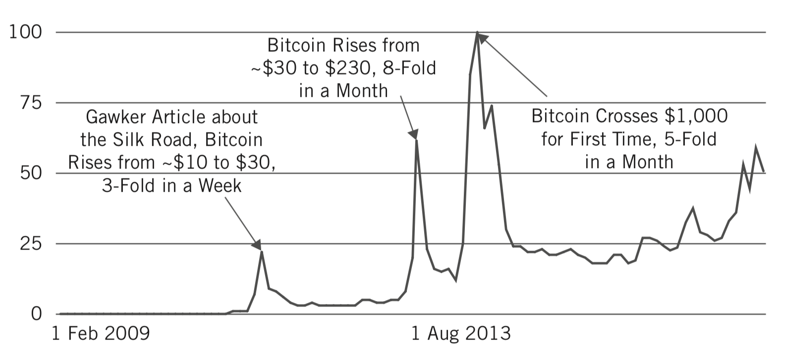
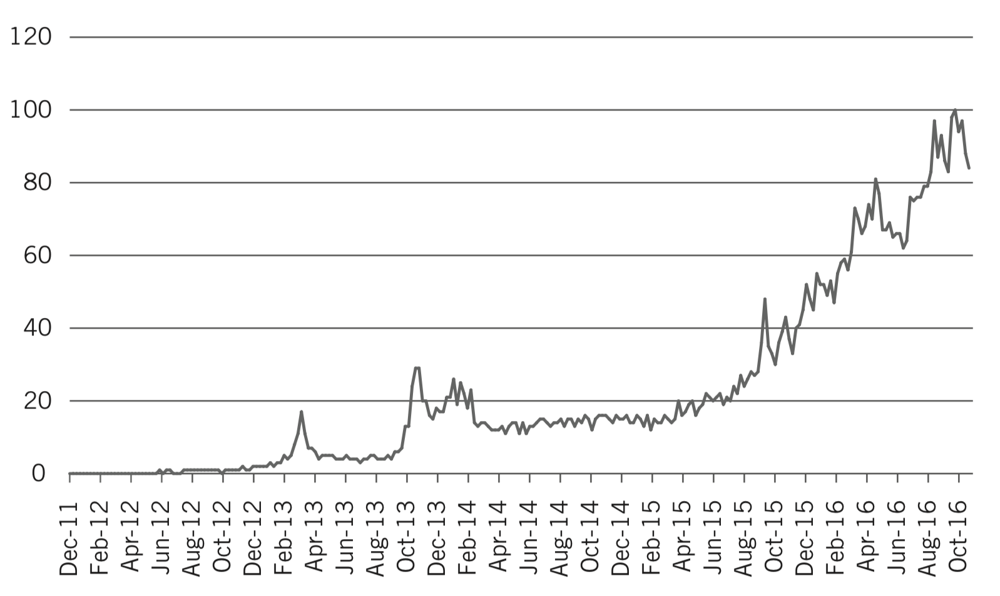
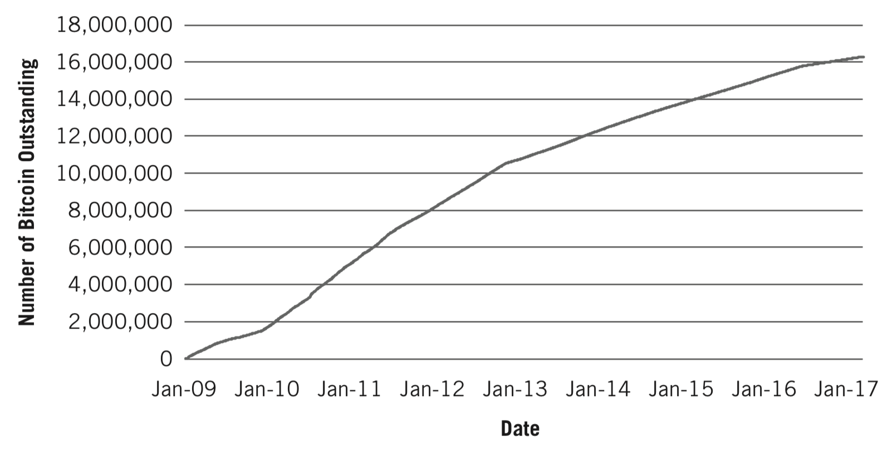
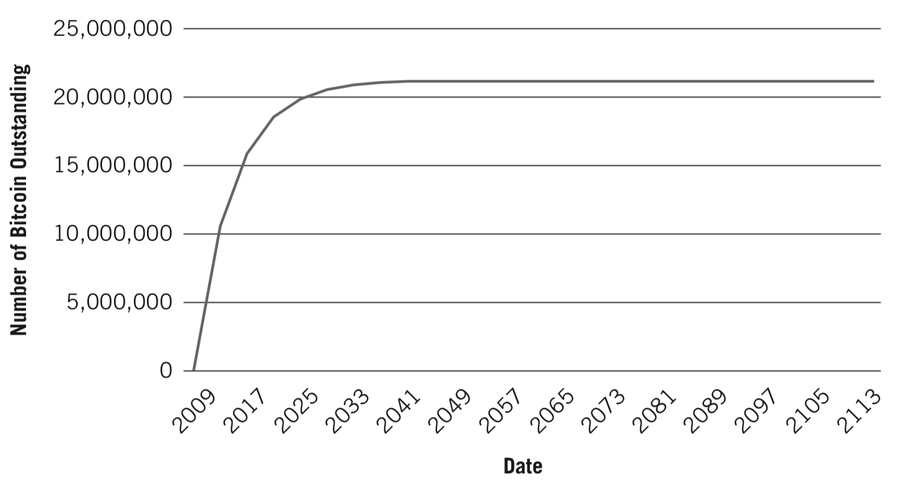
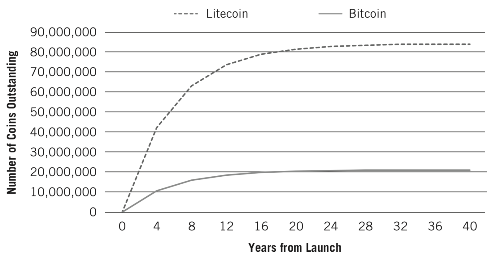
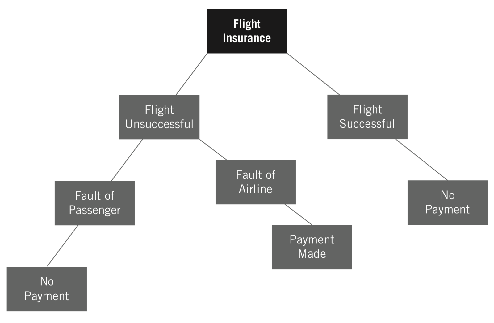
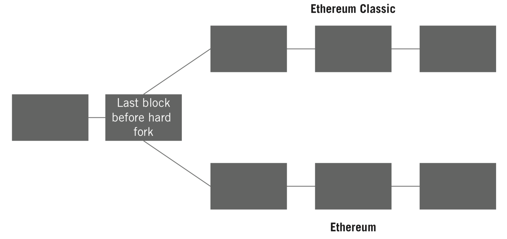

第一稿，2018年3月4日，田思源

# 第一部分

什么是加密资产？

----

# 第1章

# 比特币和2008年金融危机

2008年，比特币在华尔街几近崩溃的灰烬中凤凰涅槃般冉冉升起。在2008年8月至10月的四个月里，发生了一系列前所未有的变化：Bitcoin.org 被注册，雷曼兄弟申请美国历史上最大的破产，美洲银行以500亿美元收购美林，美国政府成立了 7000 亿美元的问题资产救助计划（Troubled Asset Relief Program，TARP），以及中本聪发表了一篇文章成为比特币以及区块链技术基础的论文。[1]

一方面金融崩溃和另一方面比特币崛起的纠缠难以忽视。金融危机给全球经济造成了数万亿美元的损失，并摧毁了金融巨头与公众之间的信任桥梁。[2]同时，比特币为价值转移提供了一个去中心化的信任体系，不依赖于人类的道德规范，而是计算机的冷静计算，并为避免华尔街的大部分需求奠定了可能的基础。

## 谁是中本聪？

将中本聪称为“他”只是为了方便起见，因为到目前为止，没有人确切地知道中本聪是谁甚至是什么。他，她，他们，或它，还完全是匿名的。在中本聪为 P2P 基金会创建的个人资料页面上 -- 他创造比特币时用它与其他人交流  -- 他写道，他是一个住在日本的37岁男性。[3]

然而在日本以外，对事实的挖掘已经使人们相信中本聪居住在英国、北美、中美洲、南美洲甚至加勒比海地区。人们指出他无可挑剔的书面英语或偶尔的英国短语作为在英国居住的证据[4]，而其他人则指出他的发帖模式表明他生活在位于东部或中部时区的地理位置[5]。也出现过一些冒牌的中本聪们，因为媒体都急于为这样一个花边问题提供解决方案。澳大利亚人 Craig Wright 在2016年5月声称自己是中本聪，并在被揭穿之前暂时吸引了诸如经济学人[6]和连线[7]等杂志的关注。[8]

现在，中本聪的起源已经覆盖了五大洲，让我们想到中本聪可能不只是一个人，而是一群人。大师中本聪展示了广泛的主题 -- 包括密码学、计算机科学、经济学和心理学 -- 并且能够流畅地沟通的能力似乎支持了中本聪不止一个人的假设。但他们会是谁呢？虽然这个谜团可能永远都不能解开，但是中本聪确实知道华尔街日益增长的不稳定性。

## 2008年的金融危机

对于金融巨头们来说，2008年被证明是一个缓慢展开的恶梦。那年3月，华尔街第一大机构 -- 贝尔斯登 -- 向它的恶魔表示顺从。在经历了八十五年的各种市场风险后，贝尔斯登终于被下滑的住房市场所拖累。 3月16日，摩根大通以每股2美元的价格将其收购，约为其一年前每股170美元的1％。[9]为促成这项交易，美联储同意帮助购买贝尔斯登的290亿美元不良资产。[10]然而，令人不安的是，收购后一个月，摩根士丹利和高盛集团首席执行官约翰·麦克（John Mack）和劳埃德·布兰克费恩（Lloyd Blankfein）分别告诉股东，房市危机将是短暂的，已接近尾声。[11]

这场危机大部分是由不负责任的放款，称之为次级贷款，即发放贷款给没有偿还能力的美国人造成的。从历史上看，当一家银行发放贷款时，银行需要对确保借款人偿还资金进行负责。但是，在许多次级贷款的案例中，一旦这些贷款发放给借款人，它们就被打包或证券化为复杂的工具，即抵押担保债券（Collateralized Mortgage Obligations，CMO）。这些 CMO 随后被出售给其他投资者，通过金融工具有效地将风险像烫手山芋一样传递出去，由于声称的多元化，购买者容易受到高回报和低风险的诱惑。

包括华尔街高管在内的人们并没有意识到CMO带来的风险有多深，意识不到它们互相之间有多盘根错节。部分问题在于，CMO 是复杂的金融工具，由混合了模拟和数字系统的过时金融架构支持。缺乏无缝的数字文档，使得量化风险并准确理解CMO的构成及其困难的，甚至是不可能的。此外，由于这些 CMO 销往全球，因此全球投资者突然间就陷入了这张巨大的美国抵押贷款之网中。[12] 2008年夏天，尽管缺乏财务透明度，由于受到获准使用美联储资金用于处理后续不良资产的鼓舞，雷曼兄弟首席执行官小理查德·福尔德（Richard Fuld Jr.）神秘地声称：“我们现在不会倒闭了。”[13]

当风暴围绕不知情的华尔街高管们酝酿时，中本聪正在忙于充实比特币的概念。 2008年8月18日，用于发布比特币信息的网站 Bitcoin.org 注册了。[14]无论作为个人还是实体，现在清楚的是，中本聪正在设计一项新技术，一种将会改善CMO不良的透明度的技术。由于区块链的分布式透明度和不可篡改审计日志，发放和打包到不同 CMO 的每笔贷款都可以记录在一个单一的区块链中。这将允许任何购买者查看其中 CMO 所有权和每个抵押贷款状态的一致记录。不幸的是，在2008年，多个不同的系统 -- 这些系统昂贵并且糟糕 -- 之间只能通过数字字符串连接在一起。

2008年9月10日星期三上午，福尔德（Fuld）及其高级管理层面不得不直面其在夏天所做的自信的宣言无法兑现的现实。管理层努力向一批重要分析师解释53亿美元的“不良资产”减计计划和当季损失39亿的事实。[15]此次通话突然结束，分析师们带着对雷曼正在采取措施的不信任离开了。市场已经在前一天惩罚了雷曼，股价下跌了45％，周三又下跌了7％。

两天后的星期五下午，美林、摩根士丹利和高盛的首席执行官们与美联储主席、美国财政部长以及纽约联邦储备银行总裁在纽约联邦储备委员会会面。下午的话题是该如何处理雷曼兄弟的问题。情况显然变得至关重要。起初，似乎要么是巴克莱银行，要么是美国银行来拯救雷曼兄弟，但这种可能性很快就消失了。

周六，在纽约联储局再次会面时，美林公司首席执行官约翰·塞恩（John  Thain）有一个令人不安的想法。在介绍雷曼的情况时，他意识到他的公司距离同一场灾难可能只有几步之遥。 “下周五可能是我坐在这里，”他说。塞恩迅速转向寻找美林的有意收购者，最有希望的选择是美洲银行，该银行已经在与莱曼就收购谈判。随着美林和美洲银行之间的谈判秘密进行，雷曼兄弟将巴克莱作为唯一有希望的收购者。

截至9月14日星期日，巴克莱准备批准购买雷曼兄弟的交易。雷曼只需要美国或英国政府支持其交易余额几天，足够让巴克莱进行股东投票以获得最终批准。两家政府都不愿意介入，而交易的可能性开始消失。在亚洲市场开放交易之前仅剩几个小时，美国政府就雷曼唯一的选择提出质疑：破产。

哈维·米勒（Harvey Miller），Weil，Gotshal＆Manges 的一位备受尊敬的破产律师，自周四晚以来一直安静地工作，为这种最糟糕的破产情景做准备。当被一位美联储高级官员问道，米勒先生是否认为雷曼应该准备申请破产，他回答道：“这将会引发金融危机。”

如果雷曼申请破产，那么与雷曼做生意的金融公司也将损失数十亿美元，这可能会引发破产的多米诺骨牌效应。

当晚晚些时候，美洲银行签署了一笔交易，以500亿美元收购美林公司，在几个小时之后，在周一凌晨，雷曼兄弟申请破产保护，成为美国历史上最大的破产案。因此，这家从干货店起家，已有164年历史，并已发展成为美国第四大投资银行的公司，结束了。它标志着一个时代的结束。

雷曼的破产和美林的收购被证明只是一个开始。周二，纽约联邦储备银行被授权向美国最大的保险商美国国际集团（AIG）提供高达850亿美元的资金，因为这个庞大的机构已开始摇摇欲坠。[19]9月中旬，阴云密布华尔街和全球金融市场。

## 比特币的诞生

六个半星期后，2008年10月31日，中本聪发布了比特币白皮书，这是现在和将来部署的每个区块链实现的起源。在其基础性论文的最后一段，中本聪写道：“我们提出了一个不依赖于信任的电子交易系统。”[20]

在发表这篇论文时，他已经对整个系统进行了编码。用他自己的话说，“我必须写出所有的代码，然后才能说服自己可以解决所有问题，然后写了这篇文章。”[21]根据历史估计，中本聪可能在2006年底的某个时候开始正式确定比特币概念，在2007年5月左右开始编写代码。在同一时间段内，许多监管机构开始相信美国房地产市场过度扩张并且可能会陷入困境。[22]很难相信像中本聪这样具有如此广泛知识的人会与他在全球金融市场中所见证的东西隔绝开来。

在发表白皮书后的第二天，中本聪发送了一封电子邮件给“密码学邮件列表”，链接到他的论文。[23]该列表由专注于密码学及其潜在应用的用户组成。中本聪的电子邮件引发了一系列的回应。

2008年11月7日星期五，为了回复日益兴奋的追随者群体，他写道：“你不会在密码学中找到解决政治问题的办法 … 但是我们可以在军备竞赛中赢得一场重大战役，并在几年内获得新的自由领地。各国政府善于斩首像 Napster 这样中央控制的网络，但像 Gnutella 和 Tor 这样的纯 P2P 网络似乎拥有自己的权力。“[24]从这句话可以清楚地看出，中本聪并没有让比特币无缝融入现有的政府和金融体系，而是希望成为一个没有自上而下控制的替代体系，由去中心化的大众管理。这种去中心化的自治也是互联网早期的基础，网络上的每个节点都是一个自治代理，通过共享协议与其他代理进行通信。

11月9日，比特币项目在 SourceForge.net 上注册，该网站旨在促进开源软件开发。为了响应越来越多关于密码学邮件列表上的询问和兴趣，中本聪在11月17日写道：“我会尝试并尽快发布源代码作为参考，以帮助理清所有这些实现问题。“[25]

然后，随着华尔街继续崩溃，中本聪安静了几个月。 2008年的《紧急经济稳定法案》（The Emergency Economic Stabilization Act）对缓解雷曼破产后发生的危机并没有起到什么作用。国会通过并由乔治·布什总统于10月3日签署的紧急法案确立了7000亿美元的 TARP。由于 TARP，美国政府获得了数百家银行以及 AIG，通用汽车和克莱斯勒等大型公司的优先股。尽管如此，股票并不是免费的。它花费了5500亿美元的投资来稳定那些摇摇欲坠的猛犸象们。

在比特币作为公共网络的开放时刻，中本聪明确表示他对全球金融体系的失败心存疑虑。在比特币区块链的第一个记录中，中本聪写道：“泰晤士报2009年1月3日，财政大臣正站在第二轮救助银行业的边缘”[27]引用了英国报纸泰晤士报上一篇关于英国政府可能需要帮助更多的银行保持运营状态的文章。[28]多年以后，人们会意识到，区块链技术最强大的用处之一就是，记录无法修改和透明的信息，这些信息永不会从数字历史上抹去，并可以免费供所有人查看。通过记录关于银行救助的说明，中本聪首先选择使用这一功能，这表明他希望我们不要忘记2008年的金融危机。

## 替代金融体系

在这个酸楚的记录之后九天，第一笔使用比特币的交易发生在中本聪和 Hal Finney 之间，这是一位比特币早期的倡导者和开发者。九个月后，将为比特币设定第一个汇率，即每个比特币0.08美分，或者1美元兑换 1,309比特币。[29]当时投入一美元，在2017年初的价值已超过一百万美元，凸显出创新带来的病毒式增长的享受。

深入研究中本聪在这段时间的文字，更加明显的是，他着迷于提供一种替代（如果不能完全取代的话）的金融体系。网络启动并运行了一个多月后，关于比特币，中本聪写道，“它完全去中心化，没有中央服务器或信任方，因为一切都基于加密证据而不是信任 … 我认为这是我们第一次尝试一个去中心化的，不基于信任的系统。“[30]

2010年12月5日，中本聪表现出了人性中胆怯的一面，在主要信用卡网络阻止用户在维基解密网站支付之后，他请求维基解密不要接受比特币作为支付手段。中本聪写道：“不，不要用它。项目还需要逐步完善，这样软件才能逐渐健壮。我恳请维基解密不要尝试使用比特币。比特币还是一个处于起步阶段的小型测试社区。通过它你们只会获得少的可怜的一点零钱，但由此带来的热浪，可能会在这个阶段摧毁我们。“[31]

此后不久，中本聪消失了。有人推测是为了比特币。毕竟，作为一项有可能取代目前的大部分金融体系的技术创造者，最终必然会引起强大的政府和私营部门的愤怒。中本聪消失在空气中，他取消了比特币的头，并带来了单点故障。但是一个拥有数千个接入点和数百万用户的网络矗立在他身后。

另一方面，华尔街遭受了许多失败。当尘埃落定，美国政府花费的钱远远超过了最初为 TARP 提供的7000亿美元担保。总共2.5万亿美元被注入到系统中，更不用说为重塑金融机构信心，承诺的12.2万亿美元。[32]

我们知道，尽管华尔街正在经历一次昂贵的死亡，而比特币的诞生却让这个世界没有花费分文。它是作为一种开源技术而诞生的，并很快就像一个没有母亲的孩子一样被抛弃了。也许，如果全球金融体系更加健康，那么支持比特币的社区就会少一些，社区最终让它成长为目前这个健壮而坏脾气的蹒跚学步的孩子。

## 欢迎来到比特币创造的世界

自中本聪消失以来，比特币已经引发了一波又一波关于推倒和反思全球金融和技术系统的浪潮。 无数的比特币衍生品被创造出来 -- 例如以太坊、莱特币、门罗币和零币等系统 -- 所有这些系统都依赖于区块链技术，这个中本聪送给世界的礼物。 与此同时，许多金融和科技企业已经开始接受这项技术，为所有创新发展产生困惑，和创新投资者最相关的东西。 下一章将包括对区块链技术、比特币、比特币技术、加密资产的理解，以及投资机会存在的地方。

---

# 第2章

# 比特币和区块链技术基础

现在来区分比特币、比特币区块链、以小写字母 b 开头的 bitcoin、区块链技术以及其他相关但截然不同的概念之间的差异。乍一看，这里有很多行话术语，阻碍了许多人甚至试图去理解它。事实上，只有少数陌生概念被封装在最近发明的词汇中，不幸将人们拒之门外。由于这些词汇在人们谈论比特币或区块链技术的不同应用时经常使用，空间似乎难以逾越 - 但并非如此。所需要的就是齐心协力确定关键概念，然后才能成为支持理解区块链技术许多应用的心灵脚手架。

以大写字母B开头的比特币（Bitcoin）是指用于比特币货币（bitcoin）转换和保管的软件。
- Bitcoin等于软件。
- bitcoin等于货币。

本书的大部分内容都以比特币（Bitcoin）为出发点。比特币是区块链运动的起源。通常将新创建的区块链和比特币比较，因为比特币区块链是最为源远流长的参考点。因此，了解比特币的基础知识至关重要。

然而，为了真正理解比特币，人们必须超越将其视为一些数字庞氏骗局或由犯罪分子使用的影子系统的看法。那些陈旧的故事继续源源不断来自媒体工厂。 2016年7月，伦敦政治经济学院，德意志联邦银行（德国中央银行）和威斯康星大学麦迪逊分校的研究人员发表了论文《比特币经济的演变》。三家知名机构不会浪费时间，也没有把他们的声誉压在一个没有增长潜力的邪恶货币上。

在那篇论文中，研究人员描述了他们对比特币区块链及其交易进行的广泛分析。以下是他们所发现内容的摘要：

    在本文中，我们将比特币身份的最小单位（个人地址）汇集在一起，并将它们分组为近似的商业实体，我们称之为“超级集群”。虽然这些集群在很大程度上可以保持匿名，但正如在2009年至2015年期间所观察到的，我们能够通过分析其中的一些具体交易模式，将其中的许多分类归入特定的业务类别。然后，我们可以提取并创建它们之间支付关系网络的映射，并分析在每个业务类别中发现的交易行为。通过确定随着比特币经济的发展和成熟而发展的三个明显的制度，我们的结论是：从早期的原型阶段；进入第二个增长阶段，这个阶段大部分是“罪恶”企业（即赌博，黑市）；进入第三阶段，标志着从“罪恶”向合法企业的急剧发展。[1]

当然，比特币的一些最早采用者是犯罪分子。但对于大多数革命性技术来说也是如此，因为通常新技术对那些希望以智取胜法律的人来说是有用的工具。在后面的一章中，我们将讨论与加密资产，包括比特币，相关的特定风险。但很明显，比特币作为一种货币的故事已经不仅仅是一种支付非法商品和服务的手段。超过100篇媒体文章曾经有机会宣布比特币已经死亡，[2]而每次都被证明是错误的。

当人们在更广泛的以技术演进主题的背景下对比特币进行中立的思考时，它就处于关键技术趋势的最佳位置。例如，世界变得越来越实时，人们以对等方式连接，无论地理或社会经济出身赋权和连接每个人。比特币适合这些专题类型。它允许全球交易将在一个小时内，而不是几天，完成。它以点对点的方式运作，这也促使优步，Airbnb 和 LendingClub 成为各自领域内数十亿美元的公司。比特币让任何人都能成为自己的银行，把控制权交给草根运动，并赋予全球无银行账户者权力。

然而，比特币比 Uber，Airbnb 和 LendingClub 可以说更令人印象深刻。这些公司去中心化了很容易理解的服务，并有点对等的先例。每个人都曾有朋友开车送他们去机场，或者和另一个国家的亲戚住在一起，或者从父母那里借钱。在没有自上而下的权力的情况下去中心化货币，需要协调的全球都接受的共同支付手段和价值储备。

货币最初是为了促进贸易，使社会能够越过易货贸易和**双重需求偶合**。随着时间的推移，它变得更加便利，从而形成目前的纸币的形态。事实上，除了其他人认为它有价值并且政府要求履行其财务义务的事实之外，这张纸几乎没有什么价值。从这个意义上讲，它是一种有用的价值共享表示。房间里的自由主义者会说这是一个价值的**有用共享幻象**，回到纸币本身没任何价值。比特币是一种类似的价值共享表示，只是它没有物理表现，也没有自上而下的权威来保护它。尽管存在这些障碍，数学的优雅让它发挥作用也使它能够增长并储存数十亿的价值。

## 比特币区块链的内部工作机制

部分比特币软件涉及比特币区块链的构建，可以将其视为数字分类账，通过借记和贷记来跟踪用户余额。从这个意义上说，比特币区块链是一个记录其本币货币，即比特币流量的数据库。这个数字分类帐有什么独特之处？

比特币区块链是一个分布式的、加密的和不可篡改的数据库，使用工作证明来保持生态系统的同步。普通人难以理解的科技术语？当然。但是是不能理解的科技术语吗？不是。

### 分布式

分布式是指计算机访问和维护比特币区块链的方式。与大多数严格控制谁可以访问其中信息的数据库不同，世界上任何电脑都可以访问比特币区块链。比特币区块链的这一特点是比特币作为全球货币不可分割的一部分。由于任何地方的任何人都可以利用比特币的区块链查看不同账户之间的借记和贷记记录，因此创建了全球信任系统。一切都是透明的，所以每个人都在公平的竞技场上。

    什么是密码学？

    密码学最初是一个可怕的词，是安全通信的科学。它涉及获取信息并对其进行搅乱，使得只有预期的收件人才能理解并使用该信息达到其预期目的。搅乱消息的过程就是加密，使其恢复原状是解密，是通过复杂的数学技术进行的。

    密码学是一个战场，那些试图安全地传输信息的人对抗那些试图解密或操纵信息的人。最近，密码学已经发展到包括向更广泛的参与者证明信息所有权的应用程序 -- 例如公钥密码学 -- 这是比特币中密码学的一个重要组成部分。

    加密技术已经被使用了数个世纪。在战争期间，朱利叶斯·凯撒使用了一种简单的加密方法来将计划通知他的将军们。他会用实际的字母后面第三个字母发送消息。例如，他不会在他的消息中使用ABC字母，而会将他们写为DEF，而他的将军们会解密以理解想要发送的消息。可以理解的是，这种加密形式不会长久保持安全。[3]

    最近的一个例子是电影《模仿游戏》，主题是第二次世界大战期间，一组英国密码学家对纳粹德国的消息进行解码，这些消息使用一个名为恩尼格码密码机的编码设备加密。机器学习和人工智能领域的知名人士阿兰·图灵是该团队的主要成员，他们努力打破恩尼格码代码，最终对德国战争战略造成了破坏性影响，并帮助结束了战争。

    密码学已成为我们生活中至关重要的一部分。每次输入密码，用信用卡支付，或者使用 WhatsApp，我们都享受着密码学的好处。如果没有密码学，糟糕的参与者很容易窃取敏感信息并将其用于攻击我们。加密技术确保信息只能用于预期的人。

### 加密

在比特币区块链中记录的每笔交易都必须经过加密验证，以确保尝试发送比特币的人实际拥有他们试图发送的比特币。密码学也适用于交易团体如何加入比特币区块链。交易不是一次一个地添加，而是在“链”在一起的“块”中，因此有了术语区块链。我们将在后面的工作证明部分深入探讨这个过程的具体细节，但现在需要了解一下：密码学允许构建比特币区块链的计算机在自动化的数学信任系统中进行协作。对于比特币区块链中是否确认交易没有主观性：这只是数学。为了深入研究密码学，我们强烈推荐 Simon Singh 编写的《密码本：从古埃及到量子密码学的保密科学》。

### 不可篡改

全球**分布式**计算机可以**加密**验证交易并构建比特币区块链的组合，形成了不可篡改数据库，这意味着构建比特币区块链的计算机以**只能追加**的方式进行操作。**只能追加**意味着信息只能随着时间被添加到比特币区块链中，但不能删除 -- 在数字花岗岩中蚀刻的审计线索。一旦信息在比特币区块链中得到确认，它就是永久的，不能被删除。在事情很容易被抹去的数字世界中，不可篡改性是一种罕见的特性。随着时间的推移，这可能会成为比特币越来越有价值的特征。

### 工作证明

虽然前三个属性都是有价值的，但它们都不具有天生的新特性。**工作证明**（PoW）将**分布式**、**密码学**和**不可篡改**数据库的概念联系在一起，并且是分布式计算机就如何将哪一组交易附加到后面的比特币区块链达成一致。换句话说，PoW 特别用于处理交易是如何分组为块的，以及这些分块如何链接在一起，从而实现比特币区块链。

计算机，或被称为矿工的人，使用 PoW 互相竞争，以获得将交易块添加到比特币区块链的特权，这就是交易被确认的方式。每当矿工添加一个块，他们因为这样做而在比特币中获得报酬，这就是他们选择参加竞争的首要原因。

财务奖励的竞争也是比特币区块链安全的保证。如果任何动机不纯的参与者想要改变比特币区块链，他们需要与全球分布的其他所有为进行 PoW 所需的机器已投入数亿美元的矿工们竞争。矿工通过寻找解决密码问题的方法进行竞争，这将使他们能够在比特币区块链中添加交易块。

这个密码问题的解决方案涉及结合四个变量：时间，所提出交易的摘要，前一个块的身份以及称为**现时**（nonce）的变量。

现时是一个随机数，当通过所谓的加密哈希函数与其他三个变量组合时，会产生符合困难标准的输出。满足这个标准的难度由一个动态调整的参数定义，以便一个矿工大约每10分钟就能找到一个解决这个数学难题的方法。如果所有这些看起来都像是从消防水带中喝水一样，那没关系 -- 一开始就是这样。我们将在第4章更详细地介绍这一过程，然后在第14章中进一步深入讨论。

PoW 过程中最重要的部分是四个变量之一的前一个块的身份，其中包括创建该块的时间，交易集合，前一块的标识以及块的现时。如果创新投资者继续遵循这一逻辑，他们会意识到这将比特币区块链中的每个区块联系在一起。因此，即使是多年前创建的任何过去块中的信息都不能在不更改其后的所有块的情况下进行更改。这种变化会被分布式矿工拒绝，而这种性质使比特币区块链和其中的交易成为不变的原因。

矿工通过创建一个新的交易块来获得经济回报，这个块包含一个新挖掘的比特币，称为一个币库（coinbase）交易，以及每笔交易的费用。币库交易也会缓慢地将新的比特币放入货币供应中，稍后更多介绍。

## 比特币生态系统的有用类比

用类比的方式把所有东西联系在一起，为我们在第3章中讨论区块链技术的应用做准备（见图2.1）。

终端用户

应用

比特币软件 = 操作系统

矿工 = 硬件

图2.1 比特币是一堆硬件、操作系统、应用程序和最终用户

将这些概念想象成一堆与个人计算机相关的硬件、软件、应用程序和用户是有帮助的。

矿工使用 PoW 流程构建比特币区块链的是硬件，就像 MacBook Pro 为个人计算机提供硬件一样。硬件运行操作系统（OS）；对于比特币来说，操作系统是一种开源软件，协助前面所述的一切。这个软件是由一组志愿者开发者开发，就像大多数云所基于的操作系统 Linux 一样，由一群志愿者开发者维护。除此硬件和操作系统组合外，还有应用程序，就像 Safari 是一个在 Apple 操作系统上运行的应用程序一样。应用程序与比特币操作系统交互，根据需要将比特币区块链中的信息推送抽取。最后，最终用户与应用程序进行交互，有一天可能没有硬件或软件的概念，因为他们只需要知道如何浏览应用程序。

## 私有与公共链

一般来说，有两种类型的实体可以拥有支持区块链的硬件：公共和私有。公共和私有区块链之间的区别与互联网和内联网之间的区别相似。互联网是公共资源。任何人都可以挖掘它；没有看门人。另一方面，内联网是公司或财团用来传输私有信息的带围墙的花园。公共区块链与互联网类似，而私有区块链像内联网。尽管今天两者都很有用，但几乎没有人会争论说互联网比内联网创造了更多的价值。尽管20世纪80年代和90年代的公司声势浩大地宣称，公共互联网永远不可信任。历史站在公共网络的一边，历史不会重演，但总是惊人地相似。[4]

重要的区别在于实体如何访问网络。请记住，区块链是由分布式计算机系统创建的，它使用密码学和共识流程来保持社区成员的同步。孤立的区块链是无用我；不妨使用集中式数据库。构建区块链的计算机社区可以是公共或私有的，通常称为无许可的或有许可的。

公共系统就像比特币一样，任何拥有正确硬件和软件的人都可以连接到网络并访问其中的信息。没有保镖在门口检查ID。相反，参与网络形成了一种经济均衡，在这种均衡中，实体如果认为自己能够赚钱，就会购买更多的硬件来参与构建比特币区块链。公共区块链的其他例子包括以太坊，莱特币，门罗币，大零币等，这些将在第4章和第5章中详细讨论。

另一方面，私有系统在门口雇用保镖。只有具有适当权限的实体才能成为网络的一部分。这些私有系统是在比特币之后出现的，因为企业和机构意识到他们喜欢比特币区块链的效用，但却不希望或合法地允许在公共实体之间传播信息。

到目前为止，这些私有区块链已经被金融服务所广泛接受，作为更新 IT 架构的一种手段，自从为 Y2K 漏洞做好准备以来，这些架构并没有大规模改版。在金融服务领域，这些私有区块链大部分都是由企业努力保持现有业务的解决方案。尽管这些解决方案有许多优点，但一些人声称，最大的变革是让大型秘密实体共同合作，共享信息和最佳实践，这将最终降低最终消费者的服务成本。[5]我们认为，由于开放式网络的发展趋势，实施私有区块链将会削弱集中式强力集团所持有的地位。换句话说，这是进一步去中心化和使用公共区块链的第一步。

私有区块链的潜在应用范围远远超出金融服务行业。银行和其他货币中介机构很快转向采用该技术，因为用例对于专门从事交易安全的系统而言显而易见。除金融服务行业外，正在探索区块链技术应用的其他企业还包括音乐行业、房地产、保险、医疗保健、网络、民意测验、供应链、慈善团体、枪支追踪执法，政府等等。[6]

在本书中，我们将关注公共区块链及其原生资产，或者我们所称为的**加密资产**，因为我们认为这是等待创新投资者的最大机会。有时候，加密资产的名称与其父母区块完全相同，但具有不同的资本化。其他时候，资产的名称稍有不同。例如，比特币区块链的原生资产是比特币（bitcoin），以太坊区块链的原生资产是以太（ether），莱特币区块链的原生资产是莱特币（litecoin）等。

许多公共区块链彼此明显不同。早期比特币社区的一些成员认为，区块链的区别应该是非常明确的，特别是任何区块链必须使用工作证明作为共识的手段。我们不同意这种独特的世界观，因为还有许多其他正在开发中的有趣的共识机制，例如股份证明、存在证明、流逝时间证明等等。就像机器学习不仅仅是一件事，而是由符号主义者、连接主义者、进化论者、贝叶斯主义者和类推主义者组成的那样，区块链技术也有很多种。在**主算法**中，[7]个佩德罗·多明戈斯假设，所有这些机器学习的阵营 -- 都是某些时刻苦战的对手 -- 有一天将会合并。区块链技术可能也是如此。如果这些去中心化的价值数据库要真正转型，它们将不得不互操作并相互估价。

	区块链一词的多种用途

	尽管区块链技术越来越受到关注，但由于使用该术语的不准确性，对于它的具体含义仍存在混淆。 例如，“一个区块链”，“那个区块链”，“区块链”和“区块链技术”都可以指不同的东西。

	通常，当人们说区块链时，他们指的是原始区块链，或比特币区块链。虽然存在冗余风险，但为了清晰起见，我们将始终使用“比特币区块链”而不是“区块链”。

	另一方面，区块链和区块链技术等术语通常指的是现在可能与原始比特币无关的衍生产品。与此同时，区块链通常用于指代这个概念本身，并没有特别的实现。这是最无定形的，因此也是我们最不喜欢的术语用法。
----

# 第3章

# “区块链，不是比特币？”

如果在公共和私有区块链之间划分界限，我们进入了创新投资者应该理解的有争议的领域。这两种区块链和支持这些区块链的组织之间的区别剑拔弩张，因为这两个阵营的技术目标不同。面对过度普及的风险，私有区块链由其各自行业的在任者支持，而由分裂者支持公共区块链。

为了总结创新投资者接触加密资产的背景，重要的是要了解世界是如何超越了单一区块链 -- 比特币区块链 -- 而包括公共和私有区块链。否则，投资者在听到有人声称比特币不再相关或已被移除时，可能会感到困惑。这些说法都不是真实的，但是理解这些说法背后的动机和理由无论如何是有帮助的。

## 早期的比特币

我们在第1章中提到，由于比特币仍然太年轻，容易受到攻击，因此中本聪在2010年12月5日请求维基解密不接受比特币作为捐赠给其网站。这是比特币区块链诞生大约两年后的时间，在这段时间里，它生活在一个非常安静和书呆子式的环境中。这一切都将改变。

在中本聪提出请求之后的几个月里，一款软件应用程序被发布，它会让比特币名扬世界。丝绸之路于2011年2月推出，为任何可以想象的产品提供了一个无规则的去中心化市场，它使用比特币作为支付手段。你只要说出名字，丝绸之路就有。 Gawker 在2011年6月的一篇文章《地下网站可以买到任何可以想象的药物》中简明扼要地指出了这一点。[1]显然，这是比特币发展黑暗声誉的一种方式，尽管比特币及其开发团队并没有为此背书。丝绸之路通过在其平台上构建应用程序来简单地利用这种新的数字和去中心化货币。

如图3.1所示，Gawker 的文章引发了比特币历史中第一次谷歌搜索高峰，并在一周内将比特币的价格从大约10美元提高到30美元。[2]然而，Gawker 的文章引起的跳跃与2013年3月至4月的 谷歌全球搜索量相比黯然失色，相当于价格上涨了近八倍，在大约一个月内从大约30美元上涨到230美元。这种比特币需求背后的驱动因素比 Gawker 峰值更加不透明，尽管许多人指出塞浦路斯的救助以及公民以银行账户余额造成的相关损失为核心驱动因素。比特币不受政府控制使其持有者免受此类事件的影响，这使其获得了的充分兴趣。彭博社于2013年3月25日发表了一个故事，引人注目的标题是《比特币可能成为全球经济的最后避风港》。[3]

虽然2013年的春天是值得关注的，但它是比特币全球关注盛大开幕的预演。这是六个月后，2013年11月，当中国对比特币的需求增加以及美国参议院对该创新的兴趣导致了1000美元的超常攀升时，这一数据占据了国际头条新闻。[4]

图3.1 谷歌搜索“比特币”一词的峰值
来源：谷歌搜索截图的注释

	谷歌搜索趋势的实用程序

	谷歌搜索趋势是吸引主流关注的有用指标。创新投资者可以访问 https://trends.google.com/ 并探索人们如何搜索不同主题的模式。谷歌甚至可以提供按地理位置探索搜索趋势的选项，给出兴趣点在哪里的图表，以及显示相关主题上升的情况。例如，在输入“比特币”后，投资者可以查看过去一年，甚至五年的谷歌搜索趋势，或者定制范围，并调查尼日利亚与印度的差异。我们建议不仅仅对加密资产使用此工具，因为它是一个融入全球思维的迷人窗口。

此时，比特币的高涨引起了中国人民银行的注意，中国人民银行迅速对比特币的使用实施了限制，宣称“它不是一个真正意义上的货币”。[5]中国的规定，加上 FBI 抓住了丝绸之路的创造者 Ross Ulbricht，[6]不久之后，当时最大的交易所 Mt. Gox [7]的崩溃，使得许多比特币投资者在面对政府和执法部门的严厉打击时处于边缘地位。[8] 随后2014年全年比特币价格下降，2015年1月触底反弹、波动、持续，并令那些被吸引到新概念的早期采用者沮丧。

虽然比特币的价格在下降，但其开发者已经开始着手改进协议并在其上面构建应用程序。在那段时间里，关于底层技术的对话增加了势头，因为早期的比特币开发者们[9]强调比特币很重要，不仅因为其货币的去中心化，还因为支持比特币的系统架构。对于支持比特币的技术强调恰逢一群开发者和企业开始研究比特币，因为这些头条新闻引起了他们的关注。很明显，事情正在起变化，该技术的新成员正在试图弄清楚是什么。

目前比特币开发者的三件大事，防守和解释比特币技术的颠覆性潜力，比特币的价格急剧下降，以及对这项技术进行研究的新成员，导致了比特币叙述中的剧烈变化。新手并不一定以他们想要使用区块链技术的方式来看待比特币的需求，比特币的价格在2014年持续下降，这让他们再次确信这一点。但是对于比特币来说，它一直是“比特币**和**区块链“。比特币资产激励了矿工、开发者、公司和用户的玩家生态系统，基于比特币区块链保护和构建，为全球提供交换和储值服务。

在对比特币所用技术的考察中，两项运动在区块链技术领域爆炸性增长。其中之一是支持公共区块链的新型加密资产的繁衍，如以太坊。这些新的公开区块链在比特币领域之外提供了实用工具。例如，以太坊的目标是成为一个去中心化的世界计算机，而比特币的目标是成为一个去中心化的世界货币。这种多样性导致了玩家之间的紧张局势，因为这些加密资产中的一些相互竞争，但这无法与比特币和第二项运动之间的紧张关系相比。

第二项运动爆发于质疑是否需要比特币或任何加密资产才能从区块链技术中获得价值的场景下。这是我们将在本章进一步调查的第二项运动，因为对于创新型投资者来说，了解为什么有些人会声称比特币和其他加密资产不需要保持其实施的安全和运作，这一点很重要：欢迎来到私有区块链的世界。

	中本聪从来没提到过区块链

	在中本聪的2008年白皮书中没有提到区块链这个词。早期的比特币公司在当时的小众社区中普及了这个词。 例如，于2011年8月推出的流行的比特币钱包服务 blockchain.info。[10]另一方面，中本聪经常将该系统称为“工作证明链”。他的最接近区块链的说法，有“被链接的块”或“块链”之类的短语。由于中本聪仅在“链”之前直接放置了“工作证明”，因此许多早期的比特币从业者都坚称，术语区块链只能指基于工作证明的。请记住，工作证明是构建比特币区块链的所有计算机如何构建比特币时保持同步的一种机制。

## 区块链，不是比特币

类似2014年第三季度来自英格兰银行的文章认为：“数字货币的关键创新是'分布式账本'，它允许支付系统以完全去中心化的方式运作，而不需要像银行这样的中介机构。”[11]在强调技术而不是原生资产方面，英格兰银行对是否需要原生资产并没有给出答案。

在2015年4月的内部比特币会议上，[12]很多长期比特币从业者评论了华尔街有多少诉讼出席了。虽然比特币仍然为王，但是“区块链而非比特币”的声音越来越高，这对比特币从业者来说是异端。

2015年秋季，当**区域链**，独立于比特币的术语开始在北美更广泛地使用，当时两个着名的金融杂志催化了对这一概念的认识。首先，彭博市场（Bloomberg Markets）发表了一篇题为《Blythe  Masters 告诉银行区块链改变一切的文章：帮助全球信用违约掉期的银行家希望再次上调融资 - 这次是使用支持比特币的代码》[13]在强调”支持比特币的代码“时，这篇文章悄然质疑了原生资产的需求，而是强调了底层技术。马斯特斯是金融服务领域一位知名和受人尊敬的人物，一位与金融创新相联系的人士。在担任摩根大通全球商业负责人之后，她选择加入一家名为数字资产控股（Digital Asset Holdings）的当时还鲜为人知的公司，理由是相信区块链技术不再处于商业世界的边缘。在文章中，马斯特斯的一句话引起了大家的关注：“你应该认真对待这项技术，因为你应该在20世纪90年代早期开始研究互联网。这类当于钱的电子邮件。“

2015年10月31日发行的经济学人杂志在封面上刊登了《信任机器》，虽然该文章向比特币倾斜，但它的焦点是更广泛适用的“比特币后面的技术”，并在整篇文章中使用术语**区块链**。[14]

马斯特斯、彭博和**经济学人**的结合导致区块链技术兴趣的激增，引发谷歌全球搜索量持续攀升，“区块链”仍处于上升趋势。在彭博和**经济学人**发表文章后的2015年10月18日至11月1日的两周内，谷歌全球“区块链”搜索量增长了70％（见图3.2）。

图3.2 谷歌搜索趋势中术语“区块链”的上升趋势
数据来源于谷歌搜索趋势

马斯特斯在金融服务领域的区块链技术专注于私有区块链，与比特币区块链截然不同。专注于当前对话，私有区块链不需要原生资产。由于对网络的访问受到严格控制（主要通过独占性维护安全），因此支持区块链的计算机的作用不同。[15]由于这些计算机不必担心来自外部的攻击 -- 它们在防火墙后运行，并与已知的实体协作 -- 这消除了原生资产的需求，该资产激励了建立一个强大的矿工网络。

私有区块链通常用于加快现有流程并提高效率，从而奖励制作软件和维护计算机的实体。换句话说，创造价值就是节约成本，拥有计算机的实体享受这些节省。这些实体并不需要在原生资产中获得报酬作为他们工作的奖励，就像公共区块链一样。

另一方面，为了激励比特币激励自选的全球志愿者组织（称为矿工），将资金部署到验证和确保比特币交易的矿机中，需要有一个原生资产可以支付矿工的工作。原生资产以真正去中心化的方式为自下而上的服务奠定了基础。公共区块链不像系统架构那么多从底层开始筹划创建全球去中心化的数字服务。随着时间的推移，矿工的报酬将从新比特币的发行转变为交易费用，如果全球采用程度足够高，那么交易费用将足以支持矿工。

许多私有区块链的热衷支持者所持有的信念核心是，原生资产本身（比如比特币）是不相关的；它们可以从架构中移除，而技术的最佳部分可以保持完好。对于这些人正在追求的用例，这是事实。但是，对于公共区块链，这不是事实。从他们如何使用它来更新当前技术堆栈的角度来探索区块链技术的企业（非常多以数据库的形式）经常归为私有区块链。许多金融服务公司是这种思维模式的最早采用者。

除了质疑是否需要原生的加密资产 -- 这会自发地激怒那些非常重视加密资产的社区 -- 也存在紧张局势，因为公共区块链倡导者认为私有区块链运动混杂了区块链技术的精神。例如，马斯特斯的数字资产控股公司旨在帮助现有金融服务公司采用这项新技术，从而帮助现有企业反击试图破坏其地位的反叛者，而不是旨在去中心化和民主化现有金融服务现状的各个方面。

## 区块链作为通用技术

虽然我们对区块链技术最激动人心的应用有了自己的看法，但我们并不认为这是排他的世界观。相反，我们认为比特币区块链是现有最重要的区块链之一，并且它诞生了一种超越比特币的新型通用技术。

通用技术普遍存在，最终影响到所有消费者和公司。随着时间的推移，它们随着技术的紧缩进程而改善，最重要的是，它们是构建未来创新的平台。其中一些比较着名的例子包括蒸汽、电力、内燃机和信息技术。我们将在此列表中添加区块链技术。虽然这种说法可能对某些人来说显得很大，但这正是我们面临的创新规模。

作为一项通用技术，区块链技术包括私有区块链，这些区块链将会对许多行业产生深远影响，而比特币之外的公共区块链将会像突然爆炸般增长。由于私有区块链并未产生可向公众投资的全新资产类别，因此公开区块链及其原生资产的领域与创新投资者最为相关。

## 区块链技术在炒作周期中的位置

到目前为止，创新投资者将会清楚，区块链技术领域仍然在不断努力，并将在未来几年继续这样发展。迷人的技术具有吸引力，带来不同视角的新思维，并将推动技术的边界扩展。

新技术的发展以及随着其获得人们的思想共享而发展的方式，是加德纳（Gartner，是一家领先的技术研究和咨询公司）[17]新兴技术炒作周期的核心，展示了五个常见的技术阶段。[18]

- 创新触发器
- 膨胀期望顶峰
- 幻灭的低谷
- 启蒙的坡度
- 生产力高地

首先是将技术引入世界的创新触发器。虽然不是很明显，就像比特币在其生命早期几乎不可见的情况一样，文字传播和预期也在增长。随着时间的推移，这些细小的声音获得动力，成为加德纳第二阶段的高潮期 - 高峰期。峰值代表了围绕原始技术定义的混乱高度，因为人们经常乐观地将其应用于他们所看到的一切。没有技术是灵丹妙药。

随着企业萌芽并尝试将想法转化为现实，从概念验证转向大规模实施，经常会发现在现实世界中实施新的颠覆性技术要比预期困难得多。新技术必须与许多其他系统集成，通常需要广泛的重新设计。它还需要对员工和消费者进行再培训。这些困难将技术慢慢地推向了幻灭的低谷，因为人们感叹这项技术永远不会工作，或者很难处理。

当有足够的人放弃了，但忠诚的人继续工作时，技术又开始上升，这次不是不合理的。但早期的改善和生产力持续释放。随着时间的推移，该技术将逐渐成熟，最终成为生产力高地的稳定平台，为建立其他技术奠定基础。

虽然很难预测区块链技术目前落在加德纳炒作周期的哪个位置（这些事情总是回顾起来比较容易），但我们认为比特币正在从幻灭低谷中走出来。与此同时，剥离原生资产（私有区块链）的区块链技术正在从2016年夏季发生的DAO黑客攻击（我们将在第5章中详细讨论）之前达到的“膨胀期望顶峰”下降。

比特币之外的加密资产在创新触发器和幻灭低谷之间处于不同的点。这些差异是因为它们在比特币之后的不同时间点出现并且许多还在不断涌现。这足以说明，这个承诺是伟大的，张力很高，有机会等待创新投资者。现在让我们来看一下当前存在的各种加密资产。

----

# 第4章

# 加密资产分类

我们已经看到，比特币引发了加密资产革命，其成功导致了许多其他拥有自己的原生加密资产的无需许可的（公共）区块链的诞生。我们也将这些称为比特币的数字兄弟。截至2017年3月，有超过800种加密资产和一个迷人的家族树，累计网络价值[1]超过240亿美元。[2]当时，比特币是这些资产中数额最大、交易量最大的一种，远超其他，网络价值170亿美元，占加密资产总额网络价值近70％。以网络价值计算的下一个最大的加密资产是以太坊的以太，超过40亿美元。是的，自那以后这些数字发生了很大变化。加密资产发展速度很快。

随着加密资产的投资环境不断超越比特币，创新型投资者必须了解这些数字兄弟企业的历史背景、分类和适用性，才能确定潜在的投资机会。为此，我们的目标是为提供什么以及如何创建这么许多着名的加密资产的历史背景。通过这一过程，我们还将引入更多详细的概念进入创新投资者的工具集，用于调查未来的加密资产。

## 加密货币，加密商品和加密通证

从历史上看，加密资产通常被称为加密货币，我们认为这使得新用户感到困惑，并且限制了对这些资产未来发展的讨论。我们不会将大多数加密资产划分为货币，而且大多数或者是提供原始数字资源的加密商品（cryptocommodities），或者是提供已完成的数字货品和服务的加密通证（cryptotokens）。

货币实现了三个明确定义的目的：作为交换手段，价值储存手段和账户单位。然而，货币本身的形式往往没有什么内在价值。例如，人们钱包里的纸币与在打印机中的纸张价值差不多。相反，他们有价值的假象，如果社会足够广泛分享并得到政府的背书，这些货币钞票可用于购买商品和服务，为以后的购买储存价值，并作为衡量其他事物价值的价格指标。

与此同时，商品范围广泛，最普遍被认为是作为成品投入的原材料。例如，石油，小麦和铜都是常见的商品。然而，假定一种商品必须是实物，而忽略了经济中每一个领域发生的总体“线下到线上”的转变。在日益数字化的世界中，拥有数字商品才有意义，例如计算能力、存储容量和网络带宽。

尽管计算、存储和带宽还没有被广泛地称为商品，但它们可以说是与我们的实物商品同样重要的构建块，并且当通过区块链网络提供时，它们被最清楚地定义为**加密商品**。

除了加密货币和加密商品之外，还有通过区块链网络提供的“成品”数字货品和服务，如媒体、社交网络、游戏等等，这些都是由加密通证编排的。正如在实体世界中，货币和商品促进经济创造货物和服务一样，在数字世界也是如此，加密货币和加密商品一起提供的基础设施支持上述的成品数字货品和服务。加密通证正处于开发的最早期阶段，并且可能是最后一个获得吸引力的，因为它们需要构建强大的加密货币和加密商品基础设施才能够可靠地运行。

总而言之，我们认为，区块链体系结构这个新世界的更加清晰的观点包括加密货币、加密商品和加密通证，正如我们在前几个世纪已经拥有货币、商品，成品和服务一样。无论是货币、商品还是服务，区块链架构都有助于以分布式和市场化的方式提供这些数字资源。

在本章中，我们关注当今最重要的加密货币，包括比特币、莱特币、瑞波币、门罗币、达世币和 大零币。下一章将介绍加密商品和加密通证的世界，以太坊的推出及其作为去中心化世界计算机的价值主张加速了其发展。除了其作为网络价值的第二大加密资产之外，以太坊还衍生出许多其他创造性利用其网络的加密资产。

虽然我们不可能涵盖所有的加密资产，但我们将专注于那些我们认为可以帮助创新投资者获得最广泛视角的加密资产。对于那些创建了我们无法在此涵盖的资产的企业家和开发者，我们表示抱歉。在编写本书的过程中，许多令人惊叹的项目被创建，如果我们试图将它们包含在书中，那么本书就不会完成。为此，我们在资源部分给出了一个列表，以便访问其他加密资产的信息。

	为什么选择加密（CRYPTO）？

	有时候，加密这个词让人不寒而栗，也许是因为他们把它与非法活动联系在一起，但这是一个需要克服的心理偏见，这很重要。加密只是支撑这些系统的关键技术：密码学的缩写。正如第2章所讨论的，密码学是安全传输数据的科学，只有预期的接收者才能使用它。密码学用于确保加密资产安全地传输到预期的收货人。鉴于我们的数字世界和黑客日益流行，资源的安全传输至关重要，而加密资产具有这样的安全性。

## 货币不断演变的性质

早于比特币数十年前，就有对去中心化、私有和数字货币的追求。比特币及其数字兄弟只是几个世纪以来货币更广泛演变的一部分。开始时，货币是缓和易货贸易不精确性的解决方案，几个世纪以来，具有物质价值的金属硬币成为所选择的货币。法币是一种超越金属硬币的创新，因为它更容易运输，但它的全部价值依赖于政府的批准和法定货币授权。我们相信没有任何物理表征的货币是进化的下一个阶段，而在我们的互联网维系的世界中是不可避免的。

随着互联网创新的蓬勃发展，我们也认识到需要一种安全的数字支付形式。比特币最着名的祖先之一由 David Chaum 领导的一家名为 DigiCash 的公司率先推出，David Chaum 仍然是加密资产历史上最着名的密码学家之一。 1993年，在 Marc Andressen 创办网景（Netscape）之前，Chaum 发明了称为 ecash 的数字支付系统。无论数量如何，这都可以在互联网上进行安全和匿名的支付。[3]

显然，鉴于1990年代中后期的科技热潮，Chaum 的时机再好不过了，他的 DigiCash 公司有几个增长机会，其中任何一个都可能使其成为家喻户晓的名字。然而，虽然 Chaum 被广泛认为是技术天才，但作为一名商人，他留下了许多不足之处。比尔盖茨联系 Chaum，希望将 ecash 整合到 Windows 95 中，这将立即让它遍布全世界，但Chaum拒绝了传闻中1亿美元的报价。同样，网景公司对合作进行了初步试探，但管理层很快被 Chaum 的态度所拒绝。1996年，维萨（Visa）希望向该公司投资4000万美元，而 Chaum 要求7500万美元（如果这些报告是正确的，很明显 Chaum 创造的潜在价格正在下降），只得作罢。[4]

如果一切进展顺利，DigiCash 的 ecash 将被整合到所有 Web 浏览器底层中，作为全球互联网支付机制，并可能消除在线支付对信用卡的需求。可悲的是，管理不善最终使 DigiCas h陷入困境，并于1998年宣布破产。虽然 DigiCash 未能成为家喻户晓的名字，但一些玩家会在我们的故事中重新露面，比如“智能合约”之父 Nick Szabo 和 大零币 的创始人 Zooko Wilcox，他们都曾在 DigiCash 工作过一段时间。[5]

在 ecash 之后，数字货币、支付系统或价值储存还做过其他尝试，如 e-gold 和 Karma。前者因为服务于犯罪分子而陷入了 FBI 的麻烦，[6]后者从未获得主流接受。[7]追求互联网金钱的新形式吸引了当今技术巨头的注意，例如 Peter Thiel 和 Elon Musk，他们都是 PayPal 的创立人。除 Karma 以外，数字货币的所有这些尝试的问题在于，他们并不是纯粹的去中心化化 -- 无论如何，他们都依赖于一个中心化的实体，这就为腐败和受攻击的弱点提供了机会。

## 比特币的奇迹

比特币最神奇的方面之一是，它如何以去中心化的方式自举引导了支持。作为第一个这么做的货币，其重要性和困难程度再怎么强调都不过分。在人们了解比特币如何工作之前，他们经常争辩说它不具备货币价值，因为与以前的货币不同，你无法看到它，触摸它或闻到它。

纸币具有价值，因为社会成员相互认可其有价值。如果政府加入，社会就更容易同意这一点。在没有政府支持的情况下而且没有实物形式，让全球社会同意某事物具有价值并被用作货币，是货币历史上最重要的成就之一。

当比特币发布时，它的价值为零，因为它不能用来购买任何东西。最早的采用者和支持者主观地估值比特币，因为它是计算机科学和博弈论的一个迷人实验。由于比特币区块链的效用证明它本身就是互联网金钱协议（Money-over-Internet-Protocol，MoIP）的可靠工具，[8]开始使用比特币构建用例，其中一些用例现在包括促进电子商务、汇款和国际公对公支付。

在用例早期发展的同时，投资者开始推测未来的用例将会是什么样子，以及这些用例需要多少比特币。总之，当前用例和投资者基于对未来更大的用例的期望购买比特币的组合产生了对比特币的市场需求。买方愿意为某件东西付出多少（出价），以及卖方愿意该物品接受多少（询价）？与任何市场一样，出价和询价相匹配就是定价。

### 数学计量供应

支持比特币价值的关键之一是其发行模式。回想第2章，矿工们 -- 运行构建比特币区块链计算机的人们 -- 每次追加一笔交易时都会获得报酬。用每个区块中包含的币库交易创造的新比特币支付。[9]在比特币诞生后的头四年，一个币库交易将向幸运矿工发放50比特币。这个证明工作过程的难度每隔两周就会自动重新校准，目标是保持块之间的平均时间为10分钟。[10]换句话说，每10分钟发发50个新比特币，并且比特币软件增加或减少难度，以保持输出时间不变。

在比特币运行的第一年，每小时发布300比特币（60分钟，每块10分钟，每块发布50比特币），每天7200比特币，每年260万比特币。

根据我们的演变历史，人类认识某物的价值的一个关键驱动因素是它的稀缺性。中本聪知道他无法每年以260万的速度发行比特币，因为这最终没有稀缺价值。因此，他决定每210,000块（每10分钟一块需要四年），他的程序将减半在币库交易中发行的比特币数量。[11]这一事件被称为“块奖励减半”或简称“减半“。

2012年11月28日，发生第一次减半，从50比特币减少到25比特币；第二次减半，从25比特币减少到12.5比特币发生在2016年7月9日。第三减半将发生在该日期的四年后，2020年7月。[12]到目前为止，这使得比特币的供应时间表看起来大约是线性的，如图4.1所示。

然而，当我们退后并采取较长期的视角时，比特币的供应轨迹看起来几乎是线性的（见图4.2）。事实上，到2020年代末，它将接近水平渐近线，年供应通胀低于0.5％。换句话说，中本聪奖励了使用最新比特币的早期采用者以获得足够的支持，从而为网络创造了足够大的货币流动性基础。他明白，如果比特币随着时间的推移获得成功，其美元价值就会增加，而他可以降低发行率，并仍然奖励其支持者。

图4.1 比特币的供应时间表（短期观点）
数据来源于Blockchain.info

图4.2 比特币的供应时间表（长期观点）

长远来的想法是，比特币将在全球经济中变得如此根深蒂固，将不需要发行新的比特币以继续获得支持。到那时，矿工将获得处理交易的补偿，并通过高交易量的费用来保证网络的安全。

通常情况下，到2140年比特币供应量将最多达到2100万。这是继续将供应单位每四年减少一半的功能。截至2017年1月1日，比特币的供应已经达到76.6％[13]，下一块奖励减半发生在2020年，将存在87.5％的有史以来将被铸造的比特币。2100年后的几年，将达到20,999,999比特币的供应量，实际上是2100万比特币。比特币的稀缺供应时间表使得许多人认为它是数字黄金。[14]

## 代币的诞生

在发布几年之后，很明显比特币是第一个获得大量采用的完全去中心化的加密货币，但有些方面人们并不完全满意。例如，比特币的10分钟阻断时间意味着，取决于消费者何时发送，可能需要10分钟，有时甚至更长时间，将交易附加到比特币区块链上。

通常这种延迟对于商家来说比消费者更为棘手，因为商家需要知道他们在发送商品或服务之前得到了报酬。其他人担心比特币在工作证明过程中的哈希函数，因为创建专门用于这个哈希函数的硬件，并且会导致挖矿网络更高级别的集中化。对于去中心化的货币，处理交易的机器的集中化程度的提高令人忧虑。幸运的是，比特币的协议是开源软件，这意味着开发者可以下载整个源代码，并调整他们最需要修复的方面。当更新的软件准备就绪后，开发者以类似于比特币最初发布的方式发布它。新软件与比特币软件类似，但需要维护它的自己的开发者来，提供硬件的矿工以及单独的区块链来跟踪新的原生资产的借记和贷记。

通过开放源代码软件和聪明的程序员的组合，许多其他加密货币已经存在。那些只是对比特币进行细微修改的人通常被称为**代币**。

	比特币的第一个数字兄弟

	Namecoin[15]是比特币的第一个重要分支。有趣的是，它主要不是用于创建新货币，而更多的是关于如何利用区块链的不可篡改性质，我们将在下一章介绍更多用例。使用 Namecoin 创建的网站带有.bit域名（与.com域名相对），并为注册的网站提供安全和审查阻力。[16]

	Namecoin 是从在2010年的 Bitcointalk 论坛上发表的一个关于 BitDNS（DNS代表域名命名服务，它可以处理所有网址）的想法发展而来。[17]2013年，发布了名为 NameID 的服务，该服务使用 Namecoin 区块链来启用创建并访问具有 Namecoin 身份的网站。

	Namecoin 作为自己的 DNS 服务，并为用户提供更多的控制权和隐私权。与通过政府控制的服务（如ICANN）注册网站的典型方式相反，Namecoin 网站是通过 Namecoin 网络中每台计算机上存在的服务注册的。这提高了安全性、隐私和速度。要获得一个.bit网站，必须有 namecoin 才能这样做，因此需要原生资产。

### 莱特币

尽管2011年发布了一些代币，但莱特币是第一个迄今仍然保持显着价值的品种。该加密货币由麻省理工学院毕业生 Charlie Lee 开发，他是谷歌的软件工程师。当 Lee 知道比特币时，他很快就明白了其力量，并将他引向在尝试创建自己的代币之前挖比特币。在2011年9月 Fairbrix 未能成功推出以后，Lee 在10月份再次与莱特币合作。[18]

莱特币旨在通过两种方式改善比特币。首先，莱特币的阻断时间为2.5分钟，比比特币快四倍，这对于需要更快确认消费者付款的商家来说非常重要。

其次，莱特币在工作证明过程中使用了不同的哈希函数 -- 也称为块哈希算法 -- 试图让业余爱好者更容易接触挖掘过程。换个角度说，在比特币挖掘的早期阶段，人们使用中央处理器（CPU），这是个人电脑中的核心芯片，有效地迫使计算机仅用于采矿目的。 2010年，追求更高效率的人开始使用现有计算机的图形卡（GPU）用于挖矿过程。

包括 Lee 在内的许多人预计，会转向使用更专用和专门的采矿设备，称为ASIC（专用集成电路）。ASIC 需要定制生产和专门设计的计算机。因此，Lee 正确地预见到，比特币挖矿将超出业余爱好者和他们的家用PC。

Lee 想要一枚保留其端对端根的币，并允许用户不需要专门和昂贵的挖矿单位就能成为矿工。莱特币通过使用称为 **scrypt** 的块哈希算法实现了这一点，这是内存密集型计算，专用芯片（如 ASIC）难于获得重大优势。

除了这两项调整之外，莱特币的大部分仍然与比特币相似。

然而，创新投资者已经意识到，如果区块的发行速度是比特币的四倍，那么发行的莱特币总量将是比特币的四倍。情况正是如此，因为莱特币将汇集在固定的8400万个单位上，而比特币将汇集四分之一，达到2100万个单位。[19] Lee 也调整了减半特征，因此减半发生在 840,000 区块，而不是比特币的210,000。如图4.3所示，这使得莱特币与比特币相似但更大的供应轨迹。值得注意的是，加密货币从发布起，年通货膨胀率完全一样的。

重要的是要认识到，如果比特币和莱特币都被用于规模类似的市场，因此具有相同规模的网络价值，莱特币的单位价值将是比特币的四分之一，因为有四倍的单位。这是一个重要的教训，因为所有加密货币的供应计划都不相同，因此如果试图确定资产的增值潜力，则不应比较每个加密资产的直接价格。

图4.3 莱特币和比特币的比较供应时间表

莱特币的网络经常被用作比特币软件更新的试验场，原因是莱特币比比特币更灵活，因为它储存的是货币价值的一小部分。它也被用作其他加密资产的基础。在2017年初，在网络价值方面，莱特币是第四大加密资产。[20]

### 瑞波币

瑞波币是由加拿大不列颠哥伦比亚省温哥华网站开发商 Ryan Fugger 于2004年创建的一种加密货币。该项目的工作实际开始于中本聪和比特币之前，[21]当时 Fugger 正在寻找一种让社区建立一个信任链之上的资金系统的方式。例如，如果 Alice 信任 Bob，而 Bob 信任 Candace，并且 Candace 信任 Dave，则 Alice 可以通过首先将价值汇给给 Bob ，Bob将相同的价值转给 Candace，并将该价值存放在 Dave 的账户中的方式将钱汇给 Dave（她不认识）。使用这个概念，支付可以通过这些信任链在网络上”波浪传递“。 Fugger 把这个概念称为RipplePay.com。

虽然 Fugger 的RipplePay 的确增长到了 4000 个用户，[22]但它并没有引起像比特币那样的轰动。 2012年8月，著名的金融创新者 Chris Larsen 和 Jed McCaleb 接触了 Fugger。Larsen已经成立了	E-Loan -- 首批在线提供抵押贷款的公司之一 -- 和端到端对点贷款领域的领导者 Prosper。[23]McCaleb 是当时世界上最大的比特币和加密货币交易所 Mt.Gox 的创始人。

Fugger 宣布了这一合作伙伴关系：“我相信如果有人能够在全球范围内开发瑞波概念，他们可以。他们的系统基于比特币风格的区块链，非常类似于我们在过去几年里这里讨论的一个有趣的可能性，但是采用了一种新型的无矿工共识机制，可以在近乎瞬间确认交易。“

有趣的是，2012年11月，Fugger 的这个声明出现在比特币专用沟通渠道上，这是一个 Reddit 风格的网站，名为 bitcointalk，标题是《瑞波币是比特币杀手还是补充者？ Mt.Gox 的创始人将发布瑞波币》。[24]这不会是最后一次有人问新贵是否会成为比特币杀手。

之后不久，在2013年春天，宣布 Larsen 和 McCaleb 的开发瑞波协议的公司，当时的名为 OpenCoin，已经从包括 Andreessen Horowitz 的著名风险投资家们手里获得了资金。[25]这是一个值得注意的发展 — 标志着加密货币的可行性获得了来自世界上最受尊敬的风险投资公司之一的认可。OpenCoin 稍后改名为瑞波实验室（Ripple Labs）。

瑞波的技术有几个创新。它没有矿工。相反，它使用了一种基于可信子网络的共识算法，以保持更广泛的去中心化验证器网络的同步。这足以迷惑任何创新投资者。重要的是要认识到，瑞波币的共识算法依赖于某种类型的信任，这与比特币的工作证明设计有很大不同，它假设任何人都可能是一个坏的参与者。

瑞波还使用可信网关作为用户端点，这些网关可以存入和赎回包括传统法币的各种资产配对。这建立了 Fugger的原始信任链，但是在全球多资产的规模上。通过瑞波币的网络传送交易就像通过互联网发送一个信息包，在连接的服务器中走通。

如果用户不想依赖这些网关，瑞波也有自己的原生加密货币，称为瑞波币，通常称为 XRP。 XRP 可用于连接瑞波网络中没有信任连接的两个端点。

但即使这个概念是出于好意，瑞波团队也进入了有争议的领域。由于没有挖矿过程，因此无法分配 XRP。取而代之的是，1000万单位的 XRP 被创建并最初由瑞波实验室（当时的OpenCoin）持有。虽然现在仍然有意将所有这种 XRP 分配给种子使用，但在写作本书时 XRP 的大部分仍在瑞波实验室的控制之下。

这导致了很多加密货币社区对瑞波协议的不信任。后来创建以太坊的 Vitalik Buterin 于2013年2月在**比特币杂志**上写道：“由于货币分配问题，OpenCoin 很可能面临一场艰苦的战斗，让社区相信他们是值得信赖的。”[26]

像 CoinCap 这样的定价服务并没有列出瑞波币列出的1000亿的 XRP 总可用供应量，[27]只包括迄今为止已经分配给公众的瑞波币，只是370亿单位。[28]给创新投资者一个提醒：使用新的加密货币，重要的理解它如何分配和向谁分配（我们将在第12章中进一步讨论）。如果核心社区认为分配不公平，那可能永远困扰着加密货币的成长。

此后，瑞波币不再是普通人的交易机制，而是现在“让银行能够通过网络实时发送国际支付“[29]，这一重点对瑞波币的优势起到了推波助澜的作用，因为它旨在成为一种快速支付系统，重新考虑代理银行业务，但仍需要一定的信任，银行非常适合。

### 小狗币

2013年12月8日（在比特币达到1,242美元的高位后不到两周）加入了一个有点可笑的加密货币，以小狗币的形式出现。[30] 小狗币作为剥去小狗 Doge 发布，连线杂志将其作为2013年的纪念物[31]。[32] Doge是一只柴犬，其图像上带有内部独白的标题。

小狗币最初是作为一个笑话上市的。在Adobe悉尼办事处的市场部门工作的杰克逊帕尔默是一位加密货币爱好者，他发出了这样一条推文：“投资小狗币，非常确定这是下一件大事。”[33]在积极接受了开始的玩笑后，他买了域名 Dogecoin.com。杰克逊的活动引起了俄勒冈州波特兰开发者 Billy Markus 的注意，这位开发者有意推出新的加密资产。用 Markus 自己的话说：“我说的第一句话是，'这太好笑了'，然后我说'我应该做这个币'。”[34]

Markus 使用莱特币的代码来演化出小狗币，从而使它与比特币有了更多的分离度。如果莱特币是比特币的孩子，那么小狗币是比特币的孙子。一个值得注意的变化是，小狗币计划发行比比特币甚至莱特币大得多的小狗币。计划是1.5年后将会有1000亿小狗币流通。[35]当达到最大供应量时，这比比特币多近5000倍。

Markus 的团队后来选择每年发行大约50亿个币，这与通货紧缩的比特币和莱特币形成了截然不同的供应时间表。小狗币对大多在互联网打赏中获得了吸引力。供应时间表已经将单个小狗币的价值保持在几分之一美分，这适合于其预期的使用情况。帕尔默在一次早期采访中表示：

	人们并不认真对待自己，也没有让人们担心自己是否会变得富有 ... 这是分享的感谢或荣誉。[36]

帕尔默的市场营销专业知识是当时区分于其他加密货币的另一个特点。小狗币社区通过小狗币筹集了50,000美元，将牙买加雪橇队送去奥运会；通过小狗币筹集了55,000美元，用于赞助在Talladega赛道拥有小狗币徽标的美国汽车比赛协会（NASCAR） 车手；并通过 Doge4Water 募集资金支持肯尼亚的清洁水项目，并通过基于推特的打赏服务提供捐赠。[37]

尽管小狗币可能是作为一个笑话发布的，但它与广受欢迎的互联网纪念物想联系，其轻松的起源以及对精明营销的精明关注导致了快速增长，其网络价值仅在发布七周后就增长到了7000万美元。 [38]但那并没有持续太久。截至2017年3月，其网络价值已降至略高于2000万美元。

加密资产和流行文化这种奇怪的结合并不令人意外，因为在2013年一年中，比特币价格从1月份的13美元涨到12月初的1000美元以上。[39] 小狗币的用户社区的力量和热情不应该被打击，即使我们鼓励创新投资者对其作为投资进行充分的尽职调查。虽然小狗币存在缺陷，但它仍然存在，并且已经提供了在互联网时代加密货币领域有关收集社区支持的宝贵经验。

	极光币：冰岛的国家加密货币？

	就像匿名的中本聪一样，极光币的创造者也有一个非常有名的名字：Baldur Friggjar Óðinsson。 Baldur 基于莱特币的代码创建了极光币，并决定将加密货币“空投”给冰岛人民，想要为居民提供全部极光币的50％。希望这种分配能够启动国家对加密货币的使用。

	Baldur 计划的关键是他能使用政府的国家识别系统，导致投机者错误地认为极光币是由冰岛政府资助的。对空投预计，投机者投标极光币的网络价值超过10亿美元。[40]

	到2014年3月25日空投开始的时候，投机者已经有所降温，而且极光币的网络价值仅略高于1亿美元。到该月底，它将低于2000万美元，因为接受极光币的公民转而在交易所出售它以获利。[41]随着价格的下降，对新的加密货币失去了信心和热情。很少有零售商愿意接受极光币，它很快就被认为是“失败的实验”。[42]有些人还认为它是一个由其创建者设下的骗局。到目前为止，极光币获得在全国范围内广泛使用的加密货币的头筹。

	它仍然存在，不多的冰岛开发者致力于复兴这一概念和技术。2016年，广告开始出现在冰岛首都雷克雅未克，预示着极光币的回归。因此，为极光币购买冰岛的啤酒，[43]许多其他零售商开始使用加密货币。然后，一场丑闻袭来，总理被迫辞职，因为他参与了巴拿马文件。[44]这导致了一个名为海盗党的政党的名气增加，这个党派对加密货币持赞同观点。[45]突然间，有人猜测[46]冰岛可能会重新审视极光币的潜力及其作为国家加密货币的作用。[47]随着接受程度的增加和政治的变化，观察冰岛加密货币的下一步发展将是有趣的。

	极光币对投资者和开发者都是一个警示。开始时，一个看似强大且令人信服的用于加密资产的用例，受困于其无法为其想要影响的受众提供价值。冰岛人获得了一个加密货币，但只有很少的教育和手段使用它。毫不奇怪，该资产的价值崩溃，大多数人认为它已经死亡。尽管如此，加密货币很少会完全死亡，如果开发团队能够找到前进的方向，极光币可能会有更多有趣的时刻。

## 隐私之争：达世币，门罗币和大零币

虽然莱特币、瑞波币和小狗币都添加了作为加密货币的组成部分，但它们并没有提供许多早期比特币倡导者所渴望的隐私。即便对比特币来说，这也是一个常见的误解，即它是一个匿名支付网络。比特币交易是**匿名的**，因为任何第三方都可以看到任何交易，所以任何想要查明参与者的人都可以获得丰富的信息。不可思议的是，一个想用货币进行非法活动的人更适合使用现金而不是比特币。对于每笔交易，比特币在比特币区块链中留下了不可磨灭的数字标记。

目前，三种着名的加密货币将隐私和匿名作为优先考虑。按照发布顺序，它们是达世币，门罗币和大零币。三者以不同方式追求该价值主张。门罗币可能与创新投资者最相关，有持续的操作记录，可靠的密码学和完善的发行模式。虽然 达世币 有其优点，但它有有争议的起源。与此同时，大零币使用了世界上一些最前沿的密码学，但它是本书中最新的加密资产之一，仅适用于最有经验的加密资产投资者。

### 门罗币及其前身字节币

门罗币是一个不太知名的称为字节币的加密货币的后代。字节币与比特币完全不同，采用 CryptoNote 技术。与莱特币的 scrypt 类似，CryptoNote 的块哈希算法旨在通过要求支持通用芯片（如PC中的CPU）的操作顺序来避免支持网络的矿工的专业化和集中化。[48]除了专注于更加平等的工作证明，CryptoNote 提供了难以追踪的付款，无法链接的交易和区块链分析阻力。[49] Adam Back 被认为是中本聪工作证明算法的灵感来源，并且是在比特币领域最重要的公司之一 Blockstream 的总裁。 2014年3月，他在推特上发布推文，称其为比特币以外的加密货币领域中为数不多的几个有“存在的理由”的想法之一。

有人可能会问，为什么门罗币抢走了字节币的风头。 2014年3月12日，字节币的区块链和发行自己的字节币开始于2012年7月4日，但直到近两年后才于2014年3月12日发布在 bitcointalk.org 上才为人所知。人们对于为什么字节币团队花了两年的时间来公开感到很好奇，但却感到困惑。一些人认为，这是因为开发者想要确保技术运行良好，才能吸引更多注意力。其他人则认为有些更阴险的事情在发挥作用，称为**早产**（即为“预挖矿”）。

字节币计划通过挖矿过程发行1846.6亿字节币，但在公开发行时，已经存在1500亿比特币，占总供应量的80％以上。[52]经典的余挖矿方式，字节币已经以不利于更广泛的社区悄然发布了大量的币。比特币和无许可的区块链运动建立在平等主义透明公开的原则基础之上，因此预挖矿被广泛地忽视。虽然它们仍然存在，但许多人都认为创新型投资者应该小心它们。一个骗局和良好的意图两者之间的一个关键区别是发行模式背后的开发团队的沟通和理念。

2014年4月8日，名为“eizh”的bitcointalk.org用户后来成为门罗币开发者，发表评论说：“我很惊讶有人没有开始公平分配和积极开发克隆。”[53] 2014年4月9日，名为“thankful_for_today”的相关用户在字节币发布之后仅一个月，在 bitcointalk.org 上发布了一篇题为《比特门罗币 — 基于 CryptoNote 技术的新币 -- 发布》的帖子，意图在9天内开始挖矿。[54] 比特门罗币很快更名为门罗币，通常被称为 XMR。

门罗币的最大特点是它使用了**环形签名**，这是一种自1991年以来一直在发展的密码技术。[55]在比特币的背景下，最好地解释了门罗币的环形签名。在比特币中，为了创建一个交易，一个已知的人在其试图发送的比特币的余额上签字。在门罗币中，一组个人签署了一项创建环形签名的交易，但该组中只有一个人拥有该门罗币。 CryptoNote 网站简洁地说：

	对于环形签名来说，我们有一组人，每个人都有自己的秘钥和公钥。环签名证明的声明是，给定消息的签名者是该组的成员。与普通数字签名方案的主要区别在于，签名者需要单个密钥，但验证者无法确定签名者的确切身份。因此，如果你遇到了 Alice，Bob 和 Carol 公钥的环形签名，你只能声称其中的一个人是签名人，但无法精确确定是谁。[56]

虽然许多人对这种隐私持怀疑态度，但应该指出的是，它对可替代性具有巨大的好处。可替代性指的是任何货币单位与另一个同等面额单位一样有价值的事实。比特币的一个危险是，特别对于已知用于非法活动的余额，如果交易所或其他服务将该余额列入黑名单，那么该余额变得没有流动性，并且可以说比其他比特币的价值低。虽然微妙，但失去可替代性可能是数字和分布式货币的消亡，损害所有单位的价值，而不仅仅是用于非法活动的价值。幸运的是，这是门罗币不必处理的一个问题。

门罗币的供应计划是莱特币和小狗币的混合体。对于门罗币而言，每隔 2 分钟就会在区块链中添加一个新区块，类似于莱特币的 2.5 分钟。然而，像小狗币一样，从2022年5月开始，它的整个生命周期都会有小幅度的通胀，其时每分钟会发布 0.3 个门罗币，每年总共有 157,680 个门罗币。那时候，将有 1810 万单位门罗币，所以第一年的通货膨胀率将是唯一的 0.87％。[57]随着我们进一步走向未来，随着门罗币的基数突出，通货膨胀率下降。有趣的是，到2040年，比特币和门罗币将会有几乎相同的单位，而在2019年至2027年期间，门罗币的供应膨胀率将低于比特币，但在其他时期则相反。[58]

可以预期的是，门罗币在交易中创造隐私的能力是一项技术突破，在加密资产社区和市场中得到了认可。截至2016年底，门罗币拥有所有加密货币的第五大网络价值，并且是在2016年成为表现最佳的数字货币，价格在年内上涨2,760％。这清楚地表明了对隐私保护加密货币的喜好程度。毫无疑问，这些兴趣中的一些来自不太体面的来源。

### 达世币

另一种针对隐私和可替代性的加密货币是 达世币。它于2014年1月19日，在门罗币之前几个月推出了它的区块链。它的首席开发者 Evan Duffield 通过分叉比特币协议创建了 达世币，并实现了一个专注于隐私和快速解决交易的币。Duffield 在合著的 达世币白皮书中概述了他的意图：

	一种基于比特币，中本聪的工作，以及各种改进，例如称为 Masternode 网络的两层激励网络的加密货币。其中还包括其他一些改进，例如 Darksend，用于提高可替代性，以及 InstantX，允许即时交易确认，而无需集中化管理。[59]

无论如何，达世币 成为了摇滚明星。它不是预挖矿，它有所谓的**即时挖矿**（instamine），在首个24小时内创建了190万个币。考虑到三年后，2017年1月，仅仅是700万币，这是一个重大的错误，极大地有利于在首个24小时内支持 达世币 网络的计算机，特别是 Duffield 本人。

Duffield 合理地表示了最好的意图，他说：“在前几个星期我工作在 达世币 上期间，我正在进行一项非常具有挑战性的日常工作。因此，我每天晚上都要灭火，并在白天保持警惕（同时被我的老板他几次抓到我的时候就大吼大叫）。“[60]

从我们的角度来看，如果在推出加密货币时发生重大中断或错误，导致其分配明显偏离，那么应重新启动加密货币。事实上，Duffield 很容易就可以重新发布 达世币，特别是考虑到即时挖矿开始广为人知时网络还只有几天的时间，但他决定不这样做。考虑到其他加密货币通过分叉原始代码完成这件事，重新启动并不会很少见。例如，门罗币的创造者特别选择不继续构建字节币，因为预挖矿被认为是不公平的。

### 大零币

2016年最受关注的加密货币是一种名为 大零币 的新型加密资产。比特币和区块链社区一直对匿名和隐私的新发展感到兴奋，但大零币将这种兴奋提升到了一个新的水平，一旦发布，价格即将上升。和比特币一样，大零币的发行模式也是道德的。但是，当比特币从零单位出手时，旁边没有人知道它。当大零币从零个未完成单位发布时，似乎整个加密宇宙都知道它，并且每个人都想要一些。

初期供应短缺加上炒作推动大零币的价格达到天文数量级别。它迅速达到每枚币1000美元，当时甚至高于比特币的价格。 Poloniex 是一个流行的加密资产交易所，它的价格曾经在某个时间点达到了1 大零币 兑 3299 比特币，或在当时接近 200万美元。[61]然而，到2016年底，歇斯底里消退了，大零币 稳定在45美元到50美元的范围交易。

大零币 团队由 Zooko Wilcox 领导，我们之前曾提到他是 David Chaum 的 DigiCash 的早期员工。通过他在 DigiCash 的时间以及长期参与密码学和加密资产的工作，Zooko 已经成为社区中最受尊敬的成员之一。 大零币 的一个关键创新是使用一种称为 zk-SNARKs 的零知识证明，它允许交易在各方之间传送，除了交易的有效性不需要披露任何信息。尽管 大零币 还处于早期阶段，但我们认为 Zooko 及其团队的道德和技术印记是顶级的，意味着好的事情在于等待这个萌芽的加密货币。

•••

到2016年底，比特币的价格已经达到仅低于1000美元的水平（2017年1月价格打破了这一水平），并且在一个市场中共有超过800个加密资产，总计超过170亿美元。当时，按网络价值排序的顶级资产是：比特币、以太坊、瑞波币、莱特币、门罗币、经典以太坊和达世币。

创新投资者可能从这份清单中注意到，以太坊在比特币之后。它的故事是一个包括杰出的开发者，更广泛的区块链技术定义，以及迄今为止加密生态系统最大的黑客之一。在下一章中，我们将看看以太坊的创建以及它对加密资产未来的重大影响。

----

# 第5章

# 加密商品和加密通证

加密货币是一种强大的垂直加密资产，但正如我们在上一章开始时所陈述的那样，只有三个中的一个。另外两个，加密商品和加密通证，是这个萌芽的新资产类别的一个快速增长的领域。首先，我们来看一下加密商品。

在某些方面，加密商品的价值比加密货币更有形。例如，最大的密码社区，以太坊，是去中心化的世界计算机，可在其上构建全球可访问和未经审查的应用程序。很容易评价使用这种计算机的价值，因此以太坊提供了一种数字有形资源。付费使用以太坊的世界计算机 -- 也被称为以太坊虚拟机（以太坊 Virtual Machine，EVM） -- 让人想起学校和图书馆共享给学生使用的计算机。在继续前，一个人可以坐下并使用一台计算机一段时间，然后另一个人会来使用它。

以太坊虚拟机的运行方式与共享计算机有些类似，只是它具有全球范围的规模，并且有多个用户可以同时运行它。正如每个人都可以在世界任何地方看到比特币交易一样，任何人都可以在世界任何地方看到以太坊的程序运行。虽然这一章将深入以太坊作为一个加密商品，但还有许多其他萌芽的加密商品，提供去中心化的资源，像云存储、带宽、转码、代理重新加密等。

## 以太坊的世界计算机背后的想法

以太坊的创始团队及其原生资产ether，并不是第一个梦想全球分布式计算机程序，也就是通常所说的智能合约的人。例如，Nick Szabo，也是 DigiCash  的 Chaum 的门徒之一（第4章），自20世纪90年代初以来，一直在谈论智能合约和数字财产。1996年，他在杂志**熵**（Extropy）上发表了题为《智能合约》的文章。[1]

智能合约是理解的关键，但有一个误导性的名称。人们在听到智能合约时首先想到的是法律文件，这些文件可以为自己思考，这大错特错。我们认为智能合约更好地被看作是**有条件的交易**，因为它们指代以“如果这样，那么那样”为条件的代码编写的逻辑。例如，可以很容易地在一个智能合约中编程，即“如果杰克错过了他的航班，而且如果这是航空公司的错误，那么该航空公司向他支付飞行费用。”自动售货机是另一个常用的智能合约：“如果用户投入足够的钱，并且如果用户输入正确的代码，那么用户就可以获得多力多滋（Doritos，百事的一款食品）。”这些条件可能变得更加复杂，根据编程的过程和需要满足的变量创建条件瀑布。

尽管 Szabo 对有智能合约的早期愿景，但以太坊团队将首先创建一个主流且引人注目的平台，以去中心化的方式执行智能合约。该团队的核心是 Vitalik Buterin，被许多人认为是以太坊的中本聪。

Buterin 出生在俄罗斯，但在加拿大长大。他幸运地拥有一个自由思想的父亲[2]，他在2011年2月向17岁的Buterin 介绍了中本聪的工作和比特币。[3]比特币在那个时候只运作了两年，没有大的替代品存在。直到那年的10月，查理李（Charlie Lee）才会发布莱特币。

很快，Buterin 就钻入了比特币兔子洞。他很快成为领先的密码资产领域的知名记者之一，甚至联合创建了**比特币杂志**，该杂志仍然是区块链架构技术分析的最佳站点之一。在撰写将复杂的技术信息与热情乐观的风格相融合的作品时，他用他的数学实力考虑如何改进这项技术。毕竟，他在18岁时获得过国际信息学奥林匹克竞赛的铜牌[4]，并且据报道，他的脑子中可以以常人速度的两倍计算三位数加法。[5]

为此，Buterin 修改了一些比特币项目，这些项目将告诉他未来在以太坊的工作。在一篇名为《以太坊：即将上市》的博客文章中，他以向比特币致敬开始：

	我在11月的旧金山一个寒冷的日子写下了以太坊白皮书的初稿，作为几个月思考的高潮，并且经常令我们称之为“加密货币 2.0”的领域的令人沮丧的工作 -- 简言之，不仅仅将比特币区块链用于金钱。在以太坊开发的几个月里，我有幸与几个试图实现彩色硬币、智能财产和各种去中心化交换的项目密切合作。[6]

Buterin 在最后一句中提到的项目更加抽象地使用比特币的区块链来处理比特币交易。正如我们已经知道的，交易比特币涉及信息的传输，从而导致用户地址中的比特币余额的借或者贷。

Buterin 在博客文章中提到了**彩色硬币**。这涉及在比特币中标记一个地址，其中的信息不仅仅是该地址中比特币的余额。其他标识符也可以附加到地址上，例如表示房屋所有权的信息。在将该地址中的硬币转移到另一个地址时，关于房屋所有权的信息也被转移了。

从这个意义上说，通过发送比特币，交易也意味着房屋产权的交易。有几个监管机构需要认识到，这个例子中的转移已成为日常现实，但关键是要展示如何通过比特币区块链传递各种价值。

	交易对手（Counterparty）：比特币上的智能合约

	交易对手是一个运行在比特币之上的加密商品，于2014年1月推出，与以太坊类似。它拥有260万个原生资产，XCP，的固定供应量，这些资产都是在推出时创建的。正如在交易对手的网站上所描述的，“交易对手可以让任何人编写特定的数字协议或称为智能合约的程序，并在比特币区块链上执行它们。”[7]由于比特币允许少量数据在交易中传输并存储在比特币区块链上，它成为了交易对手更灵活功能的记录系统。由于交易对手依赖于比特币，因此它没有自己的挖矿生态系统。

	比特币开发者没有将其额外功能和灵活性直接添加到其软件中的原因是，他们已经将安全性优先于复杂性。交易越复杂，利用和攻击这些交易的机会越多，这可能会影响整个网络。由于重点是去中心化化的全球货币，比特币开发者已经决定比特币交易不需要任何的花里胡哨。相反，其他开发者可以找到基于比特币功能有限的构建方法，将比特币区块链转变为记录和安全手段（例如，交易对手），或构建完全不同的区块链系统（例如，以太坊）。

许多人正在努力在比特币之上构建这个去中心化化的未来，但这并不容易。为了可扩展性和安全性，在比特币中有目的地限制了为地址添加标识和创建不同种类的交易的灵活性。毕竟，比特币仍然是一个实验。去中心化的货币足以成为中本聪的圣杯，他不必一口吞下整个世界。但是 Buterin 并不满足于比特币，并且有着广泛的改进愿望。他想要一个更加灵活的系统，其表现形式更像是一台计算机，而不像计算器，用于比特币余额的借和贷。

虽然他于2013年发明了以太坊，但 Buterin 于2014年1月在北美比特币会议上正式宣布了它，[8]在那里他被渴望的记者包围，其中许多人在过去的几个月里一直是他的同事。那时候，他已经在社区外展团队中获得了超过15位开发者和数十位社区延伸团队的支持。[9]

在以太坊最初描述其内部运行机制的白皮书中，Buterin 的团队对他们的愿望毫不怀疑：

	然而，以太坊更有趣的是以太坊协议远远超出了货币。协议有关去中心化式文件存储，去中心化计算和去中心化预测市场的，以及其他几十种这样的概念，都有可能显着提高计算行业的效率，并第一次通过增加经济层面到其他端对端协议提供了大规模的推动。[10]

重要的是，Buterin 也不打算以太坊和它的原生资产以太成为比特币代码库的一个小变化。这将以太坊区分于以前出现过的许多代币。

通过与名义上的“币”无关，以太坊正在超越货币的想法进入**加密商品**领域。虽然比特币主要用于在人与人之间发送货币价值，但以太坊可用于在程序之间发送信息。它将通过构建一个去中心化的世界计算机和图灵完整的编程语言来实现。[11]开发人员可以编写程序或应用程序，这些程序或应用程序可以在这个去中心化的世界计算机上运行。正如苹果建立允许开发人员构建应用程序的硬件和操作系统一样，以太坊也承诺在分布式全球系统中这样做。以太，原生单位将发挥如下作用：

	以太是运行分布式应用平台以太坊的必要元素 -- 燃料。这是平台客户对执行所请求操作的机器进行的一种付款方式。换句话说，以太是确保开发人员编写高质量应用程序（浪费的代码成本更高）并且网络保持健康（人们获得对其贡献资源的补偿）的激励。[12]

以太坊矿工将处理交易，这些交易不仅可以传递以太，还可以在程序之间传递的信息。就像比特币矿工获得比特币得到支持网络的补偿一样，以太坊矿工也会赢得以太，这一过程将得到类似的工作证明共识机制的支持。

## 启动以太坊

Buterin 明白，从零开始建立一个系统需要大量的工作，并且他在2014年1月的公告涉及到一个由超过15位开发人员和数十位社区成员组成的社区的合作，这些社区成员已经接受了这个想法。相反，中本聪公布比特币的方式是一个安静的白皮书邮寄到一个主要由学者和核心密码学研究人员组成的相对未知的邮件列表。在推出之前，比特币软件的发展主要涉及两个人，中本聪和 Hal Finney。[13]

Buterin 也知道，虽然以太坊可以在以太上运行，但设计它的人却不能，而以太坊还有一年多的时间才能发布。所以，他通过着名的第尔（Thiel）奖学金获得资助。亿万富翁 Peter Thiel 是 PayPal 的创始人之一，并且是脸书的第一位外部投资者，创立了 Thiel 奖学金来奖励那些离开大学传统路径并追求以立竿见影的方式来影响世界的人才。获奖者可能会进行科学研究，创建创业公司，或寻找其他方式来改善社会和世界。Thiel 奖学金精心挑选的远见者在两年的时间内获得100,000美元奖金，该奖项被认为比被世界顶级大学的接收更具竞争力。 2014年6月，Buterin 作为一名20岁的退出滑铁卢大学的学生获得 Thiel 奖学金 [14]，全职从事他感兴趣的以太坊。

虽然 Buterin 可能会成为 Thiel 最大的投资之一，但 Thiel 并不是唯一认识到以太坊潜力的人。 2014年，Buterin与诸如能源类的 Elon Musk 和媒体与新闻业的 Walter Isaacson等有影响力的人物一起，获得了信息技术软件领域的世界技术大奖。[15]

虽然 Thiel 奖学金预示着 Buterin 会得到什么，但100,000美元还不足以维持团队。为此，从2014年7月23日至2014年9月2日，他们举办了为期42天的以太预售，这是以太坊网络下的加密商品。[16]

以太的销售范围为每比特币1,337至2,000以太，预售的前两周提供每比特币2,000以太，然后在销售后半段以每比特币1,337以太线性下降，通过激励人们在开始时购买从而形成势头。监督这次出售的法律和财务细微差别是新成立的总部位于瑞士楚格的以太坊基金会。[17]

以太坊的筹款活动不仅具有创新性和及时性，而且也是破纪录的。公众投资31,591比特币，价值18,439,086美元，总计60,102,216比特 -- 隐含比率为每以太0.31美元。当时，它是最大的单一众筹项目。[18]有人认为支持区块链架构的团队在没有可运行产品的情况下筹集1800万美元是不寻常的，这与比特币流程明显不同。

风险投资者（VC）经常投资于创意和开发团队，相信他们会努力实现成功。以太坊将这一进程推向了风险投资之外。从这个众包的以太价格角度来看，考虑到在2017年4月初，以太价值为每单位50美元，这意味着在三年内收益超过160倍。[19]在预售期间，仅有9,000人购买了以太，平均初始投资在2,000美元，后来增长到超过320,000美元。[20]

根据以太坊白皮书，此次销售的利润将“完全用于支付开发者的薪水和奖金，并投资于以太坊和加密货币生态系统中的各种营利和非盈利项目”。除了向公众出售6千万以太，大约创造了600万，以补偿以太坊的早期贡献者，另外还有600万用于以太坊基金会的长期储备。

对于早期的贡献者和以太坊基金会来说，额外分配1,200万以太对于以太坊来说已经证明是有问题的，因为有些人认为这代表了双重收费。我们认为，在公开发售之前涉及15名有才华的开发人员，600万以太按预售率换算为每个开发人员10万美元，这对于此类软件开发人员的市场利率来说是合理的。

也就是说，将资金分配给创始人的口袋是众包的一个重要方面。被称为“创始人的报酬”，在可以理解的和红旗之间的关键区别在于，创始人应该专注于建立和发展网络，而不是以牺牲投资者为代价来充实自己的口袋。在我们看来，以太坊开发者并没有让自己的口袋变鼓，而是把食物放在桌子上。他们的适度分配与一些加密资产创建者自那以后尝试的愚蠢行为相去甚远。

在预售之后，是以太坊网络上线之前的一个发展年。在此期间，以太坊团队与其蓬勃发展的社区保持密切联系，为社区发布概念验证用于评估，组织会议，资助基于以太坊的项目，并撰写频繁的博客更新。[21]也许因为注意到了小狗币，以太坊团队知道社区在自助的对于其去中心化式系统的重要性。尽管区块链架构是冷的代码，但它们却是温暖的社交网络。

有了他们筹集的资金，以太坊团队还能够在发布之前以中本聪和他的一小组支持人员无法做到的方式测试网络。从2014年底开始，在2015年上半年，以太坊基金会鼓励对其网络进行作战测试，无论是基层漏洞赏金计划还是涉及专业第三方软件安全公司的正规安全审计。[22]创新投资者应该注意到这种战斗测试实践，我们也在 大零币 中看到过，因为它表明了核心开发人员在去中心化架构中对安全措施的重视。

## 以太坊作为dApps的平台

以太坊网络及其所基于的区块链于2015年7月30日开始运营。尽管大量开发资源被用于创建以太坊软件，但这是矿工们首次参与其中，因为最终有一个区块链为他们所支持。在这次发布之前，以太坊基本上在以太上完全停止了。现在，以太坊的去中心化平台开始营业，作为去中心化应用程序（dApps）的硬件和软件基础。这些dApp可以被认为是复杂的智能合约，也可以是由独立于以太坊核心团队的开发人员创建，从而为该技术的覆盖范围提供助力。

为了解释 dApp 是如何工作的，我们将使用来自 Etherisc 公司的一个例子，该公司为知名的以太坊会议创建了飞行保险的 dApp。此飞行保险被31位与会者购买。[23]图5.1显示了一个简化d 图。使用以太坊，开发人员可以使用条件交易字符串模拟保险库。开源这一流程，并在以太坊的世界计算机上运行它，可让日常投资者将其资金投入保险库，从购买者那里获得来自特定事件的保险费的回报。每个人都信任系统，因为它运行在开放状态，并被代码自动化。

图5.1 假设的基于dApp的飞行保险

## 欢迎来到dApps和加密通证的时代

自从以太坊发布以来，已经发布了几乎无尽的dApps流，它们中的很多都有自己的原生单位。我们称许多这些dApp 原生单位为加密通证，而其他许多人则称它们为**appcoins**。拥有自己的原生加密通证的dApp将使用以太作为加密商品来支付以太坊网络来处理某些 dApp 交易。尽管许多 dApp 使用加密通证，但某些 dApp 的原生单位应被划分为以太坊顶层的加密商品，如 Golem，其目标是成为计算密集型问题的超级计算机。区别在于是否提供原始数字资源（加密商品），或者 dApp 是否提供面向消费者的完成的数字商品或服务（加密通证）。

大多数加密通证不支持自己的区块链。这些加密通证通常在建立在密码块的区块链，例如以太坊，上的应用程序中运行。继续苹果的比喻：苹果应用商店中的应用程序不必构建自己的操作系统，它们运行在苹果的操作系统上。由于以太坊的巨大成功，其他去中心化世界计算机已经出现，如 Dfinity，Lisk，Rootstock，Tezos，Waves等可以支持他们自己的dApp的计算机。就像许多代币试图改善比特币一样，这些平台也是旨在改进以太坊设计的加密商品，从而吸引了它们自己的 dApps 和相关加密通证。

以下是以太坊 dApp 的完整列表：http://dapps.ethercasts.com/。许多dApp的代码可以在这里完整试用：https://live.ether.camp/contracts。到目前为止，我们会看看 dApps 中最出名（臭名昭著）的，因为它会告知创新投资者所有未来的 dApp 和潜在的加密通证投资。我们应该注意到，dApp 开发和相关的原生单位是加密资产空间中发展度最快的领域之一，因为我们在本书的写作过程中每周都会看到新的产生出来。因此，好奇的读者应该在本章后花时间进一步探索它们，因为我们只是在本节中抓住了冰山一角。

## DAO的上升和（硬）下降

DAO 代表去中心化的自治组织，是一个复杂的 dApp，它将去中心化的风险投资基金编程为在以太坊上运行。 DAO 的持有者将能够投票支持他们想要支持的项目，如果开发者从 DAO 持有者手中筹集到足够的资金，他们将获得建设项目所需的资金。随着时间的推移，这些项目的投资者将通过分红或提供的服务获得回报。

像 DAO 这样的去中心化式自治组织的愿景有点像自动驾驶汽车 -- 人类过去必须驾驶汽车，汽车越来越能驾驶自己。同样，虽然人类曾经是业务流程的所有方面所需要的，常用在在手动推送文件，批准和协调等方面，去中心化的自治组织可以将这些流程的大部分编码，以便公司更好地开展自我活动。令人兴奋的概念是，DAO 几乎是以太坊的毁灭。

DAO 的创造者实施了众筹融资。他们超过了以太坊筹集的金额几乎一个数量级，创造了有史以来最大规模的纪录：超过1.68亿美元。[24]众筹要求用以太进行投资，因此到最后众筹期间 DAO 团队拥有1,150万以太，占所有以太的15％。

尽管对 DAO 的热情和兴趣很明显，但一些开发者担心它尚未准备好迎接黄金时间。由一组检查了 DAO 的工作机制的计算机科学家发表的一篇论文表达了存在严重的安全漏洞担心，威胁到其在以太坊网络上的待发布版本。 Dino Mark，Vlad Zamfr 和 Emin Gün Sirer 解释说：“目前的实现可能导致具有严重后果的袭击。[25]

随后，有人呼吁暂停有关 DAO 的活动，直到问题得到满意解决。[26]但是，呼吁被忽视了，并于2016年5月28日，众筹完成后的一天，特奥代币（DAO） — 在众筹中投资的以太换来的 — 在交易所开始交易。

不到三周后，2016年6月17日，对 DAO 进行了一次重大黑客入侵，控制了360万以太，占该项目承诺数额的三分之一。黑客入侵与交易所无关，正如 Mt.Gox 和其他广泛宣传的比特币相关破解的情况一样。相反，该 DAO 的软件中存在漏洞。这款软件托管在以太坊区块链上，让所有人都能看到，而且它需要无懈可击。[27]但是，正如批评者指出的，代码并不完美。鉴于 DAO 筹集的资产规模，黑客入侵的诱因非常明显。结果，全球最大的众筹融资以及对以太坊功能的重大展示成为了一场大萧条。

Buterin 和那些涉及 DAO 和以太坊的人立即开始解决黑客攻击。然而，这种情况存在问题，因为以太坊是一个去中心化的世界计算机，为 dApp s提供运行平台。但是，它并未承诺审核并认可每一个应用程序。同样，虽然苹果可能会筛查进入其应用商店的应用程序，但它并不要求为其内部工作负责。以太坊核心开发者正在帮助 DAO 团队。这与苹果公司的工程师帮助解决一个烦人的应用程序类似。

没有任何改变这种情况的选择是特别可接受的。主要解决方案是向以太坊发布软件更新，以便从 DAO 中的黑客帐户中移除资金，并将其归还给合法股东。被称为“硬分叉”的以太坊的区块链会略微修改，以便项目中的投资者可以返还资金。DAO 背后的主要公司 Slock.it 的创始人兼首席运营官 Stephen Tual 解释说：“总之，硬分叉将从攻击者身上检索所有被盗资金。如果您购买了 DAO 通证，您将被转移到只能获取资金的智能合约。由于 DAO 中没有任何花费，所以没有损失。“[28]

然而，硬分叉会违背比特币和以太坊社区中许多人认为是去中心化账本的力量。强行从帐户中删除资金违反了不变性概念。这由于一帮中央集体的玩家做出决定而加剧。许多人抱怨道德风险，并且这将为美国政府或其他强大实体在某一天进来并要求以太坊为自己的利益做同样的事情创造先例。对于所有参与者来说，这是一个艰难的决定，包括 Buterin，他虽然不直接在 DAO开发团队中，但担任管理员。

通过对辩论双方的了解，Buterin 支持硬分叉的决定，因为他认为以太坊还处于开发阶段，像这样的一个教训将有助于塑造未来的技术。 “我认为现在的做法并不是设置先例，”他说。最终，Buterin 和大部分以太坊团队成员利用他们自己的技术技能来积极纠正 DAO 创造的情况。[30]

硬分叉并非没有风险，不幸的是，以太坊会为其帮助 DAO 的决定付出高昂的代价。虽然硬叉通常用于升级区块链体系结构，但它们通常用于社区完全同意体系结构的优化更新的情况。以太坊的情况不同，因为社区中的许多人反对硬分叉。有争议的硬叉是危险的，因为当以硬叉的形式为区块链发布新的软件更新时，会出现两种不同的操作系统。尽管两个操作系统共享一个共同的祖先，并且在其中有共同的交易记录，但一旦发生硬分叉，两个操作系统就会分裂，并且它们的区块链也会分裂，每个操作系统都有独立的原生单位。虽然有人认为，“太好了，我的钱增加了一倍”，但一个硬分叉可能会破坏两个独立区块链上的原生单位的价值，因为人们担心正在分裂的社区内的分裂（见图5.2）。有了两个独立的区块链，矿工、开发者和构建应用程序的公司、用户必须决定支持哪个区块链及其固有操作系统。虽然很多人最初声称硬分叉是以太坊的成功之作，但一些大交易者开始尽可能多地购买较少的支持链上的原生资产。

2016年7月23日，加密资产交易所 Poloniex 将新品牌网络称为经典以太坊，及其自己的原生经典以太（ETC）一起上市。[31]一旦广泛使用的交易所如 Poloniex 发售 ETC，就会为该资产创建一个开放市场，人们很快开始推测其价值。这使得更多的矿工支持经典以太坊的区块链，直到今天仍然存在，并且倾向于占有以太坊网络价值的5％。[32]

图5.2由于DAO的错误而导致以太坊分叉

经典以太坊的网站将加密资产定义为“原始以太坊区块链的延续 -- 保留未经篡改的历史的经典版本；不受外部干涉和交易的主观篡改。“[33]

虽然 DAO 可能是一场灾难，但去中心化式自治组织的概念在这个单一实例之后是可以概括的。创新型投资者应该期望能够看到多年来使用自己的加密通证的类似概念进入市场，并且应该知道，并非所有 DAO 或带有加密通证码的 dApp 都同样不稳定。

例如，Airbnb 或 Ube r都非常希望有一家功能齐全的去中心化保险公司，开发团队正在开发类似的用例。人们可以将 Airbnb 或优步视为中间商，连接服务的消费者和提供商，然后以 20％ 到 30％ 的费用来实现这一点。尽管许多商家抱怨2％至3％的信用卡费用，但 Airbnb，优步和类似平台服务的“平台费用”却处于边缘异常。许多模仿此类平台的加密通证系统计划采用低一个数量级的费用，使用底层区块链架构来促进价值和服务的去中心化转移。很多这样的系统都有自己的加密通证，可以运行在以太坊或类似的平台上。然而，有些会比其他构建得更好，而且以太坊或类似平台也不太愿意在未来的崩溃帮助 dApps。

## 预测未来的去中心化平台

开发中更有趣的一个 dApp 使用以太坊的区块链来帮助预测市场。Augur 公司寻求提供一个平台，使用户能够对任何事件的结果进行投注，为人们测试他们的预测创造一个市场。[34]因此，得到术语“预测市场”。例如，如果有人试图预测是否唐纳德特朗普或希拉里克林顿将赢得2016年美国总统大选，他或她可以使用 Augur 创造一个预测市场，并就结果（如果该服务在当时正在运行）与其他人打赌。

Augur 使用称为声誉（ Reputation，REP）的加密通证来激励人们真实地报告事件的结果。这些报告者不同于对事件结果投注的人。去中心化预测市场的问题在于，事件的结果没有集中的权威。Augur 使用 REP 来奖励那些真实地报告并惩罚那些说谎的人。 Augur 解释如下：

	有声誉的人被期望每隔几周准确报告 Augur 内随机选择的事件的结果。如果持有人未能准确报告事件的结果或企图不诚实，则 Augur 系统会将坏报告者的声誉重新分配给那些在同一报告周期内准确报告的人。[35]

Augur 在2015年进行了自己的众筹活动，销售了1100万 REP 的固定供应量的80％。为此，它筹集了超过500万美元的资金，用于创建该平台。布莱恩·阿姆斯特朗是加密领域最大的公司之一 的 Coinbase 公司的首席执行官，称其为“一个具有巨大潜力的绝佳项目”。[36]即使 Vitalik Buterin 称其为“知识优步”，也承认其潜力。

Augur 是加密通证最明显的用途之一，它的潜在成功可能为未来更多的加密通证实现奠定基础。一个类似的预测市场体系，Gnosis 在2017年4月举行了一场众筹，以隐含3亿美元的价值筹集资金。

## 一个日益增长的商品和加密通证网络

由于以太坊拥有强大的社区建设，几个类似的平台已经注意到它的成功。前面提到的 Dfnity、Lisk、Rootstock、Tezos 和 Waves 在本书编写时都处于不同的发展阶段，介于预众筹和已经实际运行之间，并他们自己的去中心化世界计算机的变体。

类似于交易对手的	Rootstock 有意运行在比特币上。 Rootstock 由Sergio Lerner 领导，他一生中大部分时间都在IT 安全领域工作。当他第一次接触比特币时，他对代码的许多方面进行了审计。他现在领导一个主要在比特币上构建以太坊的团队，并且该系统将与在以太坊上运行的所有 dApp 兼容。就像以太坊有以太一样，Rootstock 也会有自己的原生货币 RSK。

尽管有人认为 Rootstock 将成为以太坊的重要竞争者，[38]我们认为这两者将共存并提供健康的冗余。让两台或两台以上广泛认可的去中心化式世界计算机能够运行，将使 dApp 更容易从干扰中恢复。如果一个网络遇到严重的麻烦，那么 dApp 可以在另一个类似的平台上复制其状态，然后通过该平台处理所有事务。虽然过渡可能会导致令人沮丧的市场波动，但这种可选择性意味着 dApp 不会受到它们所依赖的平台的影响。

最后，冒着混淆创新投资者的风险，我们应该补充一点，dApp 可以同时使用许多加密商品，但是用于不同的基础设施目的。例如，除了使用以太坊来处理某些操作之外，dApp 还可以使用像 Filecoin 这样的去中心化云存储系统来存储大量数据，并使用另一个加密商品用于匿名带宽。

对于这样的前沿平台，创新投资者最重要的是要跟踪开发者的思路和矿工的支持。这两者对这些平台的长期发展和生存至关重要。开发人员将会快速迭代和修复错误，而矿工将提供必要的硬件和资源来保证平台的计算安全。由于这些系统是在实际中运行的去中心化系统，因此需要快速移动并妥善保护。其他开发人员才会在其上构建 dApp。

既然创新投资者已经了解了这些资产的含义，我们想要考虑为什么投资者应该考虑将资产置于其投资组合中。 虽然加密资产正在创造一个快速发展并且有点复杂的未来，但经得起时间考验的投资原则仍然适用。回到投资理论的基本面，将使创新型投资者能够正确定位其总体投资组合，以便负责任地利用加密资产的增长。
