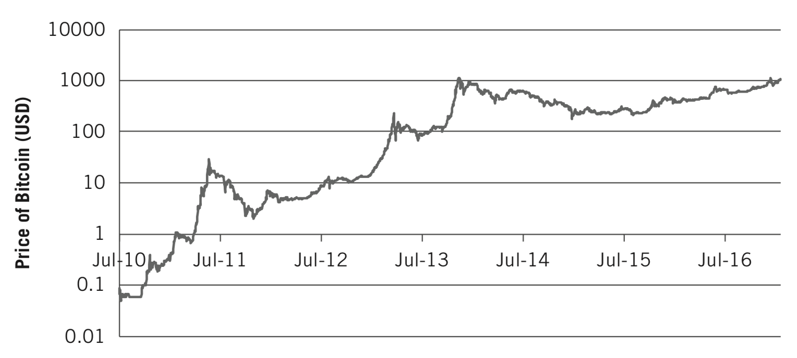
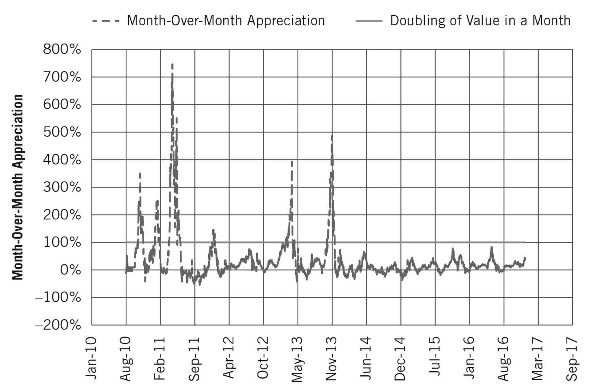
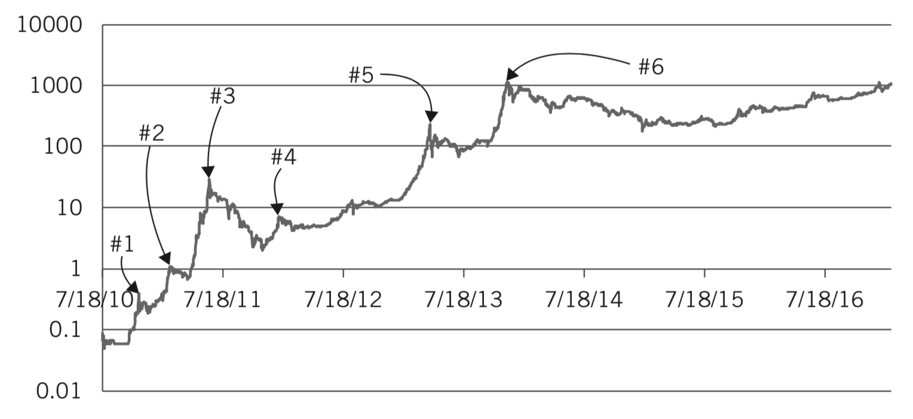
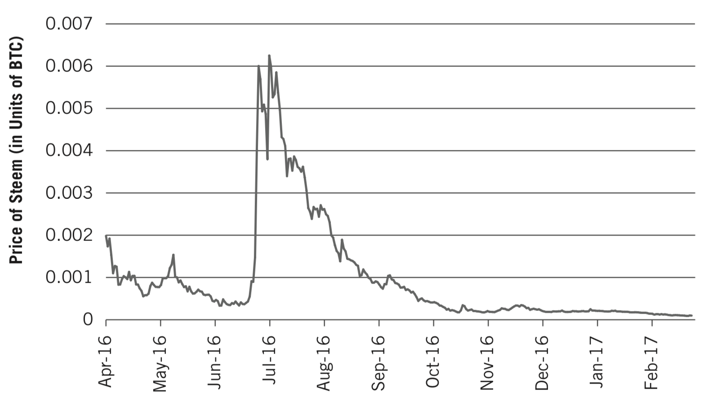

第一稿，田思源，2018年3月5日

----

# 第10章

# 大众投机与“这次不同”的思考

就像许多加密资产一样，在其走向成熟的道路上，比特币的价格经历了令人欢欣的上涨和令人痛苦的下跌。比特币和加密资产反对者中最常见的抱怨之一就是，这些波动是由市场的狂野西部本质所驱动的，这意味着加密资产是一个不可信赖的奇怪的新品种。尽管每个密码资产及其相关市场都处于不同的成熟水平，但将狂野西部行为作为加密资产市场独有的特性却充满了误导。

被许多人认为在世界上最透明、最有效和最公平的市场上进行交易的股票，在其最初几个世纪的情况很糟糕。是的，几个世纪。这些市场不仅容易出现大规模投机行为，因为人们基于基本上是编造的乞丐变富豪的故事而快速买卖，但很多时候市场都被非法操纵而不利于参与者。误导性的前景、操纵股价、虚假核算以及伪造纸张股票的发行全部导致了损失。[1]现实情况是，当今世界上一些最值得信赖的市场也有一个狂野西部的开始。

通过研究市场出现错误的最着名的例子，特别是事件发生的顺序，创新投资者更好地通过历史了解，以保护现在和未来的财富。当模式重新出现时，现在是退出的正确时机，或至少重新评估投资策略的好时机。对于任何投资而言，这种想法是谨慎的，包括投资加密资产。

这些例子还表明，加密数据并没有经历独有的怪异成长的痛苦。相反，他们正在经历数百年来新的资产类别在成熟时不得不经历的同样的变革过程。对于那些对此类事件的完整历史感兴趣的人士，我们强烈推荐爱德华•钱塞勒的《金融投机史》（Devil Take the Hindmost: A History of Financial Speculation）。

虽然随着时间的推移，市场对投资者变得危险的方式会随着时间的推移而变化，而且资产及其相关市场越成熟，市场往往变得越不安全，市场破坏稳定的可能性就永远不会消失。世界大部分地区在2008年金融危机期间都吸取了教训。

大体上，我们将导致市场不稳定的五种主要模式归类为：

- 大众投机
-  “这一次是不同的”
- 庞氏骗局
- 来自资产发行人的误导性信息
- 弯道

前两部分将在本章中详细介绍，而后三部分则保留至下一章。除了过去数十年的历史案例外，我们还举例说明了这些模式在加密市场中的表现。

## 大众投机

虽然经常是一个坏名字，但投机本身并不是一件坏事。几千年来，投机已成为市场和交易不可或缺的一部分，其中一些最早的证据来自公元前二世纪的罗马[2]。投机这个词的根源来自拉丁语specular，意思是“窥探，观察，观察，研究，探索。“[3]投机者们敏锐地关注市场走势，观察其波动并据此采取行动。

在持有资产的时间段上，投机者通常与投资者不同。他们不愿意长期持有资产。相反，他们在缩短了的时间内购买资产，然后再卖给下一个投机者。有时候他们这样做是利用他们认为会推动市场的短期信息，有时他们这样做是因为他们希望能够顺应市场的势头，而不管其基本面如何。总之，他们试图在乘坐云霄飞车的过程中获利。

相比之下，创新投资者认真研究投资价值的基础，并在市场不再显得理性时退出投资。

我们认为，无论投资什么，什么时候投资，什么时候投机，都很重要。本杰明•格雷厄姆和大卫•多德试图在他们的书《证券分析》[4]中定义投资和投机之间的区别：“投资业务经过彻底分析后，承诺本金的安全性和令人满意的回报。不符合这些要求的操作是投机性的。“

格雷厄姆在他的著名作《智慧的投资者》[5]中，认识到投机总是会出现在投资世界中，但他认为有必要区分“好”和“坏”的投机。[6]他写道：“有聪明的投机就如同有智慧的投资。但可能会有许多方式投机是不明智的。“

虽然投机者经常遭到嘲笑，但他们可能是最受富兰克林·D·罗斯福在1933年3月4日就职演说中诋毁的。当美国在1929年股市崩盘时遭遇的大萧条时期陷入困境时，对投机者有强烈不满。每一场危机都喜欢找替罪羊。罗斯福在他的讲话中称他们为“货币兑换商”以援引宗教判断：

	主要是因为人类商品交换的统治者因自己的固执和自己的无能而失败，承认失败并退位。肆无忌惮的货币兑换商的做法在舆论法庭受到起诉，被人们的心灵和思想所拒绝。

	他们确实已经尝试过，但他们的努力已经被塑造成了一种老式的传统。面对信贷失败，他们只提出了更多的贷款。为了诱使我们的人民追随他们的虚假领导，他们剥夺了利润的诱惑，他们诉诸劝诫，恳求恢复的信心。他们只知道一代自求职者的规则。他们没有远见，当没有远见时，人们就会灭亡。

	货币兑换商从他们在我们文明庙宇中的高位逃离。我们现在可能会恢复那座庙宇古代的真理。恢复的措施在于我们在多大程度上将社会价值应用于比单纯的货币利润更高尚的地位。[7]

虽然罗斯福的判断是可以理解的，但市场现实表明，投机在投资领域中占有一席之地。与典型的投资者相比，投机者往往更快速地获得机会，开始将新信息定价为资产的价值。在试图从机会中获利时，投机者帮助推动买家和卖家之间的搜寻达成双方商定的价格。当资产短缺时，无论是能源商品还是电子硬件，投机者都会迅速抬高该商品的价格。因此，更多的供应商被吸引到市场，加速了经典供需经济学中短缺的缓解。[8]

当涉及到创新时，例如引入铁路，汽车或互联网，投机为了支持这些大规模创新所需的基础设施的快速建设投入资金。投机者是首先分配资金的人，因为他们对风险的容忍度最高，并且始终在寻找新的信息。虽然投机通常以供应过剩结束，因为太多的钱最终会涌入创新，但过剩通常是暂时的。大量资本的到达和实施可能会导致产能过剩，但随着创新在随后的几十年中得到大规模应用，基础设施的丰富性证明是有用的。19世纪中期欧洲铁路迅速兴起，20世纪90年代部署光纤电缆以支持互联网，就是这种情况。

单一投机者或他们的小团体通常不会破坏市场稳定。当这些群体变成人群时，就会产生负面影响。从这个意义上说，不应该被过多地尖酸刻薄地批评投机，而应该针对超出资本市场的人群行为上。

人群理论由古斯塔夫·勒庞开创，他最着名的作品是《乌合之众：大众心理研究》。 勒庞在他后来的《革命心理学》一书中写道：

	作为群体的一部分的人与孤立的个体的人显著不同。他的有意识的个性消失在人群的无意识人格中....
	
	在人群的其他特征中，我们必须注意他们的无限信度和夸大的感性、他们的短视，以及他们无力回应理性的影响。肯定、传染、重复和威望几乎是说服他们的唯一手段。现实和经验对他们没有影响。[8]

这些特征在市场背景下是危险的。轻信或者更加直接地，易上当，会让群众很容易相信他们听到的话，无论是一起的投机者还是不同资产上市后的管理层。

轻信往往吸引个人投机者到人群中，一旦到了那里，投机者就会陷入群体思维中。勒庞提到的四个特征只是加剧了这种情况：当市场继续走高时，**肯定**会让轻信者更强烈地相信他们的策略，这种想法就像**传染**一样蔓延开来。随着投机者追逐最**负盛名的**资产的回报，这种模式一再重复。不幸的是，当市场转向而声望消失时，恐怖蔓延以同样的速度在投机人群中迅速传播。

## 郁金香狂热

商品大规模投机的最着名的例子发生在1630年代的荷兰共和国。与大多数大规模投机时期一样，时间是对的。由于商人们推动了贸易，荷兰人享有欧洲最高的薪水，金融创新处于流行中，而资金则自由流动。荷兰东印度公司的股票给予投资者的投资以十分满意的回报。[9]受鼓舞人心的是，富有的公民将资金投入房地产，催生强劲的房地产市场。持续升值的资产价值创造了过度的财富，为进一步的资产购买提供资金，在资产泡沫领域建立了一个积极强化的反馈环路。[10]

虽然富人们播种了资产泡沫的基础，但最初并不是每个人都能参与。荷兰东印度股票价格昂贵且流动性不高，除了富人之外，其他所有人都无法获得股票，对定价商品同样如此。

另一方面，郁金香能买得起。然而，由于自然的怪癖，一个买得起的郁金香有可能变身为一个可以让它的主人变得富裕的郁金香。由蚜虫传播的病毒将纯色的郁金香变成了一种珍贵的杂色品种，色彩较暗的色调通过较深的颜色呈条纹状，类似火焰[11]。当时还不知道这种杂色的原因，因此可以用于投机，因为人们尝试过预测哪些郁金香会发展出独特的色彩。

然而，在转化的另一方面，是死亡，因为病毒最终杀死了郁金香。因此，投机者像烫手山芋一样传递郁金香，希望他们能够以更高的价格将它们出售给下一个投机者，直到死的郁金香被留在最后一个人手上。

自从在16世纪中叶引入欧洲以来，郁金香就承诺带来价值，但直到1634年，病毒的传播使价格呈指数级增长，导致了通常称为的郁金香狂热。从小群投机者开始变成大众投机，因为来自其他国家的外来人士在听到巨大财富的故事时被吸引到荷兰郁金香市场。与此同时，经历了退出参与或者避开了郁金香交易，钱塞勒解释说：

	随着价格开始飙升，富裕的业余郁金香球茎收藏家们早已表现出愿意为稀有品种支付大笔款项的意愿，但他们的习俗却随着价格开始飙升而退出了市场，而伟大的阿姆斯特丹商人继续将他们的交易利润投资于镇上的房子、东印度公司股票，或者汇票 -- 对他们来说，郁金香仍然只是财富的表现，而不是达到这个目的的手段。[12]

由于郁金香在大部分生命周期中是一个球茎而不是开花，因此它适用于期货市场，荷兰人称之为风险期货，或风能交易。[13]期货市场是买方和卖方商品的未来价格达成一致。当具体时间到达时，买方必须向卖方支付约定的金额。

然而，在那些日子里，等待那个商定的时间对于大批投机者来说还不够快。郁金香期货合约本身可以进行交易，有时一天可以多达10次。[14]考虑到这些交易是人与人之间的交易，每天有10笔交易代表着流动性和疯狂的市场。

由于期货市场，郁金香的价值可能会更多地被抽象化。人们不必担心郁金香的实际交付 -- 他们只需确保他们能够以比他们自己购买的价格更高的价格出售合同。尽管郁金香狂热已经有了几年，但是在1636年底和1637年初的冬天，郁金香球茎仍然处于休眠状态，躁狂症达到顶峰。因此，在郁金香狂热中最大的投机期间并没有伴随着一朵盛开的郁金香转手。[15]

有两个因素使得人们的投机更加糟糕。根据《经济学人》杂志的一项研究，政府官员正在采取行动，并将期货合约变更为期权。其结果是：

	未来购买郁金香权的投资者不再需要购买郁金香。如果市场价格不足以满足投资者的喜好，他们可以支付小额罚款并取消合同。投资者青睐郁金香市场风险与回报之间的平衡。结果是郁金香期权价格大幅上涨。[16]

第二个因素是，许多交易开始由个人信贷记录提供资金。因此，不仅球茎没有转手，实际的钱也没有转送。交易是在未来提供货币的简单承诺。

创新投资者应该清楚，这里的价值妄想是由大众狂热造成的。正如钱塞勒指出的那样，“在躁狂症的后期阶段，风险信用与纸面信用的融合创造了非实质性的完美对称：大多数交易是针对郁金香球茎的，由于它们不存在而被支付信用票据永远不会兑现，因为钱不在那里。“

与导致2008年金融危机的房地产泡沫一样，廉价信贷通常会加剧资产泡沫。同样，在一些交易所里，投资者可以用他们没有的钱进行有效的赌注。

回到郁金香。那时，荷兰盾是荷兰共和国的货币。纸币不存在；代之的是，使用了具有实际价值的金属。每个荷兰盾包含0.027盎司的黄金。因此，37个荷兰盾有一盎司黄金，592个荷兰盾有一磅黄金。最高为郁金香支付的记录金额为5200荷兰盾，或相当于近9磅的黄金。[17]当时，平均一年的工作产生200 — 400荷兰盾，而适度的城镇房屋可以用300荷兰盾购买。取得9磅黄金的郁金香价值相当于18间普通的联排别墅：投机者花钱购买单个郁金香要花费十年以上的时间才能获得回报，而且花他们却没有的钱。

这一切都在1637年2月崩溃。春天即将来临，郁金香很快就会开花。合约日期很快就要求将信用票据转换为真实货币。驱动经济机器的商人在很大程度上并未受到影响，因为他们“继续在联排别墅、东印度股票或汇票上投资他们的交易利润。”[18]这些商人的财富引起了大众渴望类似的财富，商人们并没有受到他们沉淀的崩溃丝毫损伤。这次事故并没有引发整个经济的衰退，这是郁金香狂热的救赎之恩。

那些在投资方面经验不足的普通百姓在最严重打击的大众疯狂中被掠夺。争夺每份合同到期的金额。在泡沫破裂后的一年多时间里，荷兰政府介入宣布合同可以按其初始价值的3.5％结算。虽然支付全部合同有明显改善，但最昂贵的郁金香的3.5％仍需要一些不幸的公民工作一年。

## 大众投机加密资产

与郁金香狂热一样，加密资产也容易受到大众投机的影响。当人们注意到一些早期比特币投资者享受令人难以置信的回报，并且希望最新的加密货币、加密商品或加密通证也能让他们变得富有时，尤其如此。

然而，请记住，仅仅因为大众不受约束的热情将资产转化为不合理的高点并不意味着资产本身就是有缺陷的。郁金香仍然被享有并在全球销售。正如我们在技术和电信热潮中看到的那样，亚马逊和Salesforce等将在未来数年内为其耐心投资者带来惊人的回报。惹火烧身的投资者是那些因为其他人都在购买而购买，然后因为其他人都在出售而被出售的人。避免被这种方式烧毁的最好办法是做适当的尽职调查并进行遵守的投资计划。如果人们希望购买该资产是因为其他人都在购买这种资产并继续上涨，那么最好放弃对该投资的任何考虑。投机性泡沫在资产没有潜在的长期价值主张时尤其危险。在这些情况下，它与赌博一样糟糕（或者更糟，因为存在价值幻觉）。

我们有时听到心存疑虑的投资者对比特币的危险性提出警告。前荷兰中央银行行长 Nout Wellink 的著名说法是：“这比郁金香狂热更糟糕。至少你得到了郁金香，现在你什么也得不到。“[19]虽然我们知道有些人可能很难理解没有任何实物形式的东西可能有价值，但在其生命的这一点上，比特币与郁金香相差甚远。

理解比特币价值的关键在于认识到它具有“基于互联网协议的钱”（MoIP）的功能 — 它可以在几分钟内将大量的价值转移给世界上任何地方的任何人 — 这推动了对它的需求而不仅仅是投机。尽管郁金香具有美学上的吸引力，但认为它们的实用性与数字时代的MoIP一致则不是那么肯定。研究创新投资者可能正在考虑的任何其他加密资产的基础效用是非常重要的。

也就是说，比特币有一段时间大众暂时超过了市场。这些时间是值得研究和借鉴的，值得注意的是，比特币总是从这些大众投机中恢复过来，这是与郁金香的一个主要区别。在过去八年中，共有六个时期大众暂时控制了比特币市场。创新投资者将注意到，随着时间的推移，大众左右比特币市场的力量正在缓和。我们将包含这次深入比特币的投机过去，以帮助通知对加密资产进入市场并在大众投机期间不可避免地被卷入的未来调查。

## 比特币泡沫

当 Mt.Gox 成立后，比特币终于可以进入主流。在此之前，比特币持有者主要是计算机和密码学方面的行家们，通过运行支持网络的计算机来获取比特币。图10.1显示了自 Mt.Gox 成立以来，比特币的对数坐标上的价格行为。回想一下，具有对数坐标的图表可以很好地显示资产随时间推移的价格升值百分比。在线性坐标上，比特币早年的价格升值将不太明显。

图10.1 来自 Mt.Gox 的直到2017年初的比特币价格行为
数据来自CoinDesk

立刻显而易见的是，比特币在 Mt.Gox 开放之后的一年中的价格上涨。 当 Mt..Gox 开放时，比特币价值低于0.10美元，仅仅一年后，价值超过10美元。虽然10美元可能听起来不是太多，但考虑到在一年期间比特币增加了100倍，这意味着100美元的投资已经变成了10,000美元。

另一个重要的举措是2013年11月，当时比特币首次超过每枚硬币1,000美元的价格。尽管很多新进入这个领域的人认为这是比特币的第一个泡沫，但事实上，在此之前它有许多泡沫。图10.2显示了比特币在一个月内的价格变化百分比，或称为月环比增幅。很明显，比特币经历了六次在一个月的时间内价格翻了一番。

图10.2 比特币在一个月内价格翻倍的历史
数据来自CoinDesk

其中三次发生在 Mt.Gox 开幕后一年内。在此期间的最后一次上涨是最显着的，在2011年5月13日，价格比上个月上涨了700％以上。尽管这些价格运行有各自的驱动因素，但总的来说，它们受到更多主流用户通过 Mt.Gox 获得比特币的能力的推动。小部分信息产生了雪球效应，掀起了市场风暴。

为了理解这些气泡是如何破裂的，量化某些方面是有帮助的。首先，我们将**比特币泡沫周期**定义为在比特币价格从30天前的价格翻了一番的可以识别出来的第一天。当价格从前一个月停止下跌时，泡沫即告结束，连续三天环比上涨。比特币的价格图中可以看到这些泡沫。

图10.3 比特币的价格泡沫
数据来自CoinDesk

Mt.Gox 推出后的价格泡沫。 Gox在下列日期达到以下价格高点：

- 2010年11月6日：0.39美元
- 2011年2月9日：1.09美元
- 2011年6月8日：29.60美元
- 2012年1月8日：7.11美元
- 2013年4月9日：230美元
- 2013年12月4日：1,147美元

很明显，在 Mt.Gox 推出后不久，特别令人兴奋，但有时也令人痛心。在每个高峰的另一边有一个危险的低谷，而这些泡沫中的比特币投资者并没有幸免。在定义的比特币泡沫期间，从峰值价格到谷底价格的平均跌幅为63％。2011年6月和2013年12月达到顶峰的泡沫特别具有破坏性，损失分别为93％和85％。

比起损失的陡峭性更为阴险的是它们如何破裂，而不是上升。大幅上涨的特点往往是投资者的兴趣旺盛，随着越来越多的兴高采烈而迅速升级。另一方面，下跌则持续不断。图10.3中的定量模式是可以接受的，因为到泡沫顶峰的上升就像火箭起飞一样，而下跌就像降落伞飘到地面。

与上升相比，更长的下降时间对于创新投资者而言非常重要，因为有时候可能会觉得泡沫高峰期的下降将永远不会结束。当不能容忍进一步损失时，不成熟的投资者通常会在失败哭喊。可悲的是，这些最后的投降呼声通常是在熊市正准备好扭转的时候。

## Steemit泡沫

除了比特币以外，大量的加密资产已经经历了类似的由大众投机推动的急剧上升，以及相应下跌。一个很好的例子是在2016年中期，当时新的区块链架构 Steemit 吸引了所有人的关注。它的前提是提供一个开放的出版或博客平台，撰写优秀文章和文章的作者由读者用加密资产 steem奖励。Steemit 是某种去中心化的 Reddit，混合了博客网站 Medium 的风格。该架构得到了矿工、内容创建者、内容策划者等等之间复杂的、但是创新的货币政策流向的支持。

2016年7月1日，Steemit 的网络总价值约为1600万美元。两周后，这一数字达到3.5亿美元左右，增幅超过20倍。[20]这种价格快速变化几乎总是受到大规模投机而不是基本面增长的推动。行为变化缓慢，加密资产放出的许多用例需要主流适应这些新平台。另一方面，投机者行动迅速。

如图10.4所示，以比特币计算，Steemit 的价格在3个月后将从7月中旬的高点下降94％，到年底时下降97％。这并不意味着平台很糟糕。相反，它显示了对其前景的投机和兴奋如何助长了价格的急剧上涨和下跌。

图10.4 Steemit 的投机价格泡沫
数据来自CryptoCompare

## 大零币泡沫

2016年10月推出的以隐私为中心的新型加密货币大零币（ZEC）是最令人眼花缭乱的上涨崩溃之一。几乎没有其他加密货币比这个更加值得期待，确实如此，因为它拥有强大的工程团队。以太坊的 Vitalik Buterin 是其顾问，他将 大零币 描述为“提供使用公共区块链的优势，同时确保其私人信息得到保护。”[21]两家备受好评的加密资产投资公司 Pantera 资本和数字货币集团同样参与了 大零币。 大零币 技术专门针对达世币和门罗币占据的以隐私为中心的垂直领域，在 大零币 发布时，这两者在网络价值方面均位于加密货币的前10位。兴奋是显而易见的。

作为随后的价格泡沫的一部分，是 大零币 团队如何组织 大零币 的发行，他们善意地进行了发行。正如我们在第5章中所讨论的那样，他们选择遵循与比特币类似的发行模式，这意味着一旦推出区块链，只会有零个未完成的 大零币单位。所有单位将从零个未完成单位中有组织地发放，通过矿工竞争为大零币区块链增加区块，并通过新成立的大零币 通过币库交易获得支付。大零币团队实施了一项进一步的调整，即**慢启动**，将限制矿工交易初始规模。[22]如果大零币代码中存在任何错误，则慢启动是一个安全功能。这种谨慎的模式与众多加密资产一直在追求的众包模式（将在第16章中进一步讨论）明显不同，但它也大大限制了初始供应。

近期加密期货交易流行度的提高进一步刺激了大零币的狂热。一种名为 BitMEX 的交易所开始在 大零币 推出之前提供期货，其峰值为每大零币10比特币。[23]

有限的初始供应与广泛需求的结合导致了经典的供应短缺，提振了 大零币 的价格。在交易的第一天，币值瞬间实现了3,300比特币的价格，在Poloniex上甚至高于每个大零币 200万美元。[24]在两天之内，每大零币下跌到1比特币以下，并继续下降，2016年以每大零币 0.05比特币或大约48美元的价格收盘。[25]尽管大零币已经稳定下来，而且作为加密资产继续有很好的前景，但它火箭般的起步是由大规模投机引起的。

## 警告被泡沫诱惑的创新投资者的话

作家、教授、诺贝尔奖获得者罗伯特·席勒（Robert Shiller）将泡沫定义为“一种涉及对未来过度期望的社会流行病”。[26]我们已经对加密资产未来的期望谈论了很多。

当然，我们也相信创新投资者必须以通常的意义为基础，以便从不正当的投资中区别适当的投资，并且他们需要认识到何时是购买的机会以及何时被大众的疯狂接管。当加密资产暴涨时，可能很难抵制跳入火箭和乘坐火箭的冲动。然而，时机可能并不稳定，并且发现泡沫的终结并不容易。当泡沫破裂并且大众投机已经开始时，通常已经太晚了。艾伦格林斯潘很好地概括了这个想法：“你可以发现泡沫。它们在各方面都很明显。但是市场上的大多数参与者都不可能说出它破裂的日期。按定义，每个泡沫都会萎缩。“

## “这一次是不同的”

当资产市场被大众投机和价格接管时，通常会听到一种常见的反应：“这一次是不同的。”通常情况下，市场已经从更原始的年代发展，金融工程创新带来了不可能崩溃的强劲市场。这篇论文一再被后来的市场崩溃所驳斥。 在其备受推崇的书《这一次是不同的：金融愚蠢的八个世纪》中，卡门·莱因哈特和肯尼斯·罗格夫提供一项300页的力作，证明这个时间是永远不是不同的。

他们描述了如何“这次是不同的”思维模式被用于证明1929年的崩盘之前导致了大萧条喜气洋洋的市场的可持续性。“这次是不同的”思维模式的支持者们声称商业周期由已经由于1913年创立美联储痊愈。其想法是，美联储可以利用货币政策来提振在生产和消费都衰退时的经济，而当市场表现出过热的迹象，他们可以回到市场。其他人指出，增加自由贸易、降低通货膨胀率以及科学方法被应用于企业管理，从而导致更准确的生产和库存水平。[28]

在1929年10月16日发行的纽约时报，耶鲁大学经济学家欧文·费舍尔宣布，“股票价格已经高得看起来像一个永久的高原。” [29]他的宣言会随着历史上表现最差的股票倾覆而失败，八天以后，市场下降了11％。10月28日，它会再跌13％，并于10月29日下跌另一个12％。在此之后的声明印在了一个月后的纽约时报上，费舍尔破产了，而道琼斯指数在这次崩溃之前几乎失去了一半的价值。[30]

相似的想法是在90年代末和21世纪初的科技和电信繁荣的特征，而正如钱塞勒雄辩地描述道：

	上世纪90年代的牛市是伴随着类似于20世纪20年代的新时代的意识形态重新出现，被称为“新范式”或“金发女郎经济”（像童话故事中的粥，它既不太热也不冷），该理论认为，美联储控制通货膨胀，联邦赤字的下降，全球市场的开放，美国企业的重组，并广泛使用信息技术来控制库存水平，已经联合起来废除商业周期。一点一点地对比，这是欧文·费舍尔新时代理念再生之日。[31]

类似于20世纪20年代，20世纪90年代股票分析师和投资经理合理化昂贵的市场，声称不再适用估价公司的老方法。有新方法合理化流理鼻血的价格。[32]

## 相同的模式持续存在

我们将在下一章讨论的估值的想法，对于加密资产特别具有挑战性。由于它们是一个新的资产类别，它们不能像企业所那样估值，并且基于类似商品的供求特点估值有一定的正确性，但并不完全足够。因此，我们预测，随着空间的增长，并有可能到令人眼花缭乱的水平，我们将再次听到重复的论调，旧的估值方法不再适用。当创新投资者听见这个论调，重要的是保持高度戒备状态，并调查新的估值方法是否确实有道理。

在这本书中，我们试图保留消息，即创新投资者可能是一类新的投资者，就像加密资产是一个新的资产类别。但是，我们也一直在提醒读者来自过去的教训，以及经时间检验的投资组合和资产分析工具。忽略这些教训必将导致陷入思想的陷阱：不仅这一次事情不一样，他们也是不一样的投资者。

一般情况下，这些陷阱遵循一个模式：最初，可能有潜在的价格升值的支持，以及最根本的创新。但是这个价格升值以及其背后的故事可以成为一个自我实现的预言。人们为朋友和家人赚钱容易着迷，即使他们对买什么知之甚少。在这样的时候（如郁金香狂热），大多数人信奉“更大傻瓜”的理念：只要能够以更高的价格将资产卖给更大的傻瓜，就能赚钱。大众投机不可持续性的一个关键指标是新进入者和缺乏经验的进入者涌入市场。

由于金融机构为投机者提供了贷款手段，所以他们可以购买更多的资产，而不用手头的现金，因此泡沫通常会因廉价信贷而恶化。从这个意义上说，金融机构因为看到廉价信贷而陷入了投机泡沫，因为从来没有即时信息能够为投机者提供的资产远远超过他们手头的现金。 提供廉价信贷的个人投机者和金融机构都陷入了人群理论的漩涡之中，并相信自己“这一次是不同的”。

更糟糕的是，在市场过热时，通常也是误导资产发行人、庞氏经营者和市场操纵者出场之时。因此，我们将在下一章谈到这三个主题。