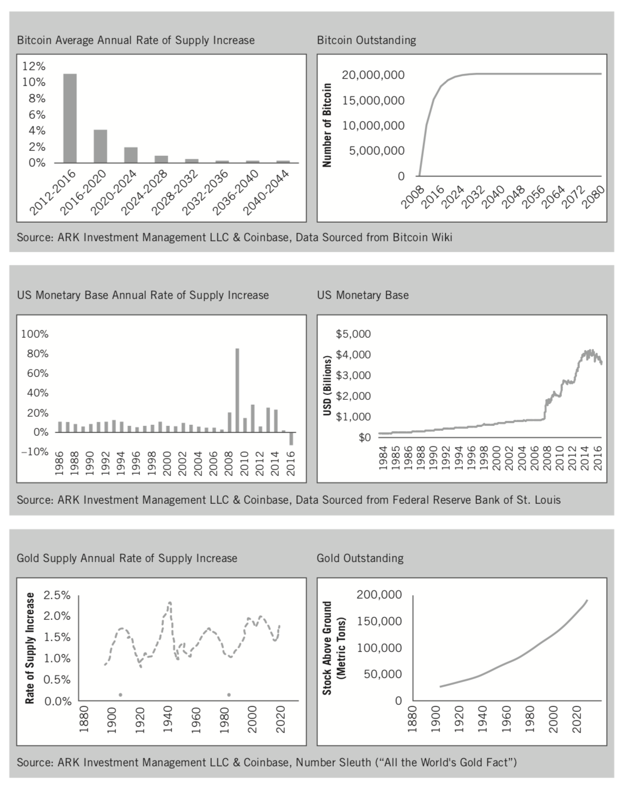
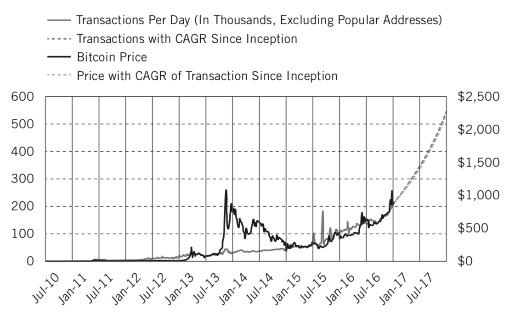
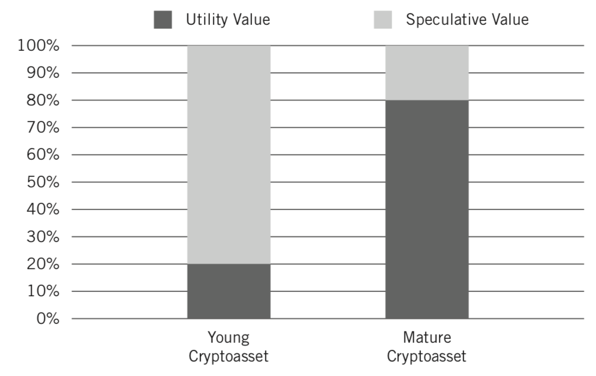

# 第8章

# 将加密资产定义为新资产类别

到目前为止，我们已经介绍了比特币的诞生，区块链作为通用技术的兴起，加密资产的简要历史，投资组合管理的关键，以及比特币其前八年的历史中在现代投资组合理论中的表现。创新投资者现在需要的是一个框架，以理解未来所有加密资产预期的一般模式。为了为该框架奠定基础，我们需要首先定义加密资产是什么类型的资产。

正如商品期货交易委员会似乎相信的，比特币及其数字兄弟代币被定义为商品一样？[1]还是它们更好地被认为是财产，正如国内税务局已经提出的？[2]证券交易委员会迄今为止指明了如何讲一个特别的标签给所有的加密资产，尽管在2017年7月下旬，它发布了一份报告，详细说明了一些加密资产可以如何被分类为证券，最显著的例子是DAO。[3]

尽管监管机构正在努力澄清至少对其中一些加密资产的分类方法，但它对加密资产的验证很有效，但大多数现行法律都存在同样的缺陷：代理机构正在通过过去的视角来解读加密资产。

使情况更加复杂的是，并非所有的加密资产都是一样的。正如股票存在多样性一样，分析师根据市场资本、行业或地理位置对公司进行细分，加密资产也存在多样性。比特币、莱特币、门罗币、达世币和大零币满足货币的三种定义：作为交换手段，价值储存和账户单位。但是，正如我们所看到的，许多其他加密资产起到了数字商品或加密商品的作用。这些加密商品包括以太、storj、sia 和 golem。同时，还有无数的对于终端用户特定的加密通证，如  augur、steem、singularDTV 或 gamecredits。此外，所有加密资产都存在代码，这些代码基于用例以及核心开源开发者认为他们的加密资产可以最好地实现的增值功能演变。

监管机构如何可能希望将加密资产置于数百年前的类别中，而这些资产每隔几年（如果不是每隔几个月）重新定义自己并突破自己的界限？

他们不能。

重点不在于抨击监管机构，而是要表明对全新的资产类别进行分类是多么困难，特别是当它是全球首个数字化原生资产类别时。

## 那么，什么是资产类别？

虽然人们接受股票和债券是两大投资资产类别，而其他人会接受货币市场基金、房地产、贵金属和货币是其他常用的资产类别，[4]但很少有人费事首先理解资产类别是什么意思。

大和证券副总裁罗伯特格里尔（Robert Greer）在《投资组合管理杂志》1997年发表的一篇关于资产类别定义的开创性论文中写道：“那么，什么是资产类别？”。[5]据格里尔说：

	资产类别是一组资产，它们之间存在一些基本的经济相似性，并且具有与不属于该类别的其他资产不同的特征。

仍然模糊。格瑞尔随后定义了三种资产超类：

- 资本资产
- 消耗品/可变形资产
- 存储价值资产

格里尔如下说明了如何从其他的类别中识别出每个超类（粗体）：

	资本资产

	所有这些资本资产都有一个共同点。**资本资产可根据其预期回报的净现值合理估值**。因此，所有其他条件相同（它从来不是这样），金融资本资产（如股票或债券）会随着投资者的、贴现率的提高而下降，或者随着利率下降而上升。这种经济特征统一了资本资产的超类。

	消耗品/可转换（C/T）资产

	你可以消耗它。你可以将其转换为另一项资产。它具有经济价值。但它不会产生持续的价值流...这种区别的深刻含义是，C/T 资产并非资本性质，不能使用净现值分析进行估值。这使得它们在经济上与资本资产的超类不同。**C/T资产必须根据其特定市场的特定供求特点更经常地估价**。

	价值存储资产

	资产的第三个超类不能被消费；也不会产生收入。不过，它有价值；它是一个价值存储的资产。一个例子是艺术品术...更广泛和更相关的例子是货币类别，无论是国外还是国内...存储有价值的资产，可以在不确定性（美元现金）的情况下作为避难所，或者为投资组合提供货币多样化。 [作者注：他没有定义如何定价。]

格里尔的超级类别并不清晰，因为有些资产可能落入两个阵营。例如，贵金属既是C/T资产又是价值存储资产。它们被用于电子电路或变换成华丽的装饰形式（C/T资产），并且它们也仅仅被视为价值棒，不意味着任何类型的消费或转换（价值存储资产）。

加密资产最明显的属于C/T领域，因为它们具有实用性并被数字化消费。例如，开发者使用以太币访问以太坊的世界计算机，然后可以对存储在以太坊区块链中的智能合约执行操作。因此，在世界计算机的操作中，以太币被消耗掉了。然后是“关注”，这是广告的燃料，这导致了基于区块链的关注市场的形成。 Steemit 是一个社交媒体平台，拥有原生的加密资产 steem 奖励给内容创作者和策展人。Steem 创建了一个经济体系，通过奖励创作者获得新的高质量内容，因为该内容增强了平台，从而增加了steem 的价值。

尽管许多加密资产是按照市场供求动态进行定价的，与更传统的 C/T 资产类似，对于一些持有类似比特币的金条持有者而言，它仅仅是一种价值储备。其他投资者以类似的方式使用比特币以外的加密资产，持有该资产以期随着时间推移升值。因此，可以将加密资产看作贵金属，因为它们属于两种资产超级类别。

据格里尔介绍，在这些超级类别之下，有类。在类中，有子类。这些分类可以帮助创新投资者理解他们以彼此相关的不同方式投资，并使他们能够最大程度地分散投资组合。

例如，在资本资产的超类中有一类是股票，而在股票类别中，有大头值或小盘值增长等子类。加密资产是属于C/T和价值存储之间的一个超类。 加密资产类中有加密货币、加密商品和加密通证的子类。

	ETFS 和共同基金是包装，而不是资产类别
	
	应该指出的是，当我们谈论资产类别时，我们并没有以下面的方式这样做，投资工具可能会“容纳”底层资产，无论该工具是共同基金、ETF 还是单独管理的账户。随着金融工程和几乎所有资产的证券化的发展 -- 尤其是随着 ETF 的日益普及 -- 人们可能会在 ETF 中的某个时间点找到所有类型的资产。例如，比特币和以太币的 ETF 已经与美国证券交易委员会合作。就我们对资产类别的定义而言，我们将资产类别与其交易形式区分开来。

划定资产类别之间的差别并非易事。格里尔为我们提供了一个可以区分资产和经济相似点的坚实观点，但是剩下的就是“它们独特的特征使得彼此区分”。我们进一步回顾了学术文献，以明确资产类别之间的差异。本章中的许多想法都源于ARK 投资和币库在2015年末至2016年的合作，当时两家公司首次宣称比特币正在为新资产类别敲钟。[6]

## 资产类别之间的主要差异化因素

在我们对经济特征的调查中，我们发现主要差异归结为治理、供应时间表、用例和价值基础。除了经济相似性之外，资产类别也倾向于具有相似的流动性和交易量概况。请记住，流动性概况指的是市场订单的深度，而交易量指的是每日交易的量。最后，资产类别的市场行为不同，其中最重要的包括风险、回报和与其他资产的关联。

存在的一般模式是，属于同一类别的资产以类似方式行事。虽然每个类别中的独特资产与其他的行为略有不同，但与其他类别的资产的相似性比较，它们更接近。

一个类中的全新资产在行为上会与同类中较成熟的资产有所不同。成熟度差异对加密资产尤为重要，其最古老的资产只有8年的历史，而新生儿则以每周的节奏抵达。

目前，对加密资产集最好被描述是一个新兴的类。它们的治理、供应时间表、用例和价值基础的经济特征从任何特定加密资产的源起就相对固定。随着时间的推移，当这些资产成熟了，流动性状况和市场特征将随之变化。本章的其余部分将集中讨论加密资产的经济特征，而下一章将深入讨论随着时间的推移不同加密资产的流动性概况和市场特征的演变，以及这些趋势与其他资产的比较。

## 资产类别的经济特征

对于创新投资者来说，评估加密资产需要其他资产的类似分析。出发点是要识别和确认那些符合其资产类别的经济特征。我们相信可以通过在四个标准的基础上对它们进行评估来完成。

### 如何治理？

正如国家治理一样，资产也是如此。通常情况下，所有类型的资产都有三个治理层：资产采购者、资产持有者、以及一个或多个监督采购者和持有者行为的监管机构。

例如，一个典型的股票有所基于公司的管理层、公司股东和证券交易委员会作为监管机构。

能源商品及其相关衍生物，如石油和天然气，可以说更复杂。采购者的治理往往更加分散和全球化，实物商品持有者也是如此。对于这些商品的金融衍生工具，美国的商品期货交易委员会（CFTC）提供了一个监管凝聚层，而证券交易委员会对ETFs，共同基金和其他由这些资产组成的基金结构起着同样的作用。

货币是一个比较有争议的资产类别，也具有独特的治理特征。首先，中央银行控制其分配，而国民、全球企业和国际债权人通常决定货币的汇率和使用（尽管控制型国家可以操纵这些领域）。各国的监管机构各不相同，如果一个国家的货币碰上波涛汹涌的水域，有国际货币基金组织等国际监管机构出手。

加密资产遵循独特于所有其他资产类别的二十一世纪治理模式，主要受到开源软件运动的启发。资产的采购者和相关用例有三个方面。首先，一群有才能的软件开发者决定创建区块链协议或使用原生资产的分布式应用程序。这些开发者坚持开放贡献者模式，这意味着随着时间的推移，任何新开发者都可以凭借自己的优点在开发团队中获得自己的成功。

但是，开发者并不是唯一负责采购加密资产的人；他们只提供代码。拥有和维护运行代码的计算机的人 — 矿工们 — 在开发代码时也有发言权，因为他们必须下载新的软件更新。开发人员不能强迫矿工更新软件。相反，他们必须说服他们，这对整个区块链的健康和矿工的经济健康是有意义的。[7]

除了开发者和矿工之外，采购者之间还有第三级的治理：提供服务的公司在加密资产和广大公众之间提供接口。这些公司通常雇用一些核心开发者，但即使他们不这样做，如果他们是推动用户采用的重要力量，他们也可以对系统产生重大影响。

在三组采购者之后，持有者或最终用户出于投资目的购买加密资产或使用底层区块链架构。这些用户不断向开发者、矿工和公司提供反馈意见，因为如果用户停止使用加密资产，那么需求就会下降，价格也会下降。因此，购买者不断被用户追责。

最后，存在新兴的加密资产监管环境。然而，监管者仍在考虑如何精确地处理这一新兴资产类别。

### 什么是供应时间表？

资产的供应时间表可能受到其三层治理的影响，但采购商通常拥有最强的实力。例如，股票通过首次公开发行（IPO）首次发行股票。首次公开招股有助于相关公司的管理层从资本市场募集现金，并为其公司品牌获得更广泛的曝光度。公司可以通过股票薪酬或二次发行继续发行股票，但如果数量太高，他们的投资者可能会因为公司所有权被稀释而反抗。

另一方面，债券与股票明显不同。一旦公司、政府或其他实体发行债券，这是一笔固定数额的债务索赔。除了违约之外，没有关于该债务的谈判。同一实体可能会持续发行更多的债券，但除非发行是经济困境的指示器，否则通常后续发行的债券对先前发行的债券组合影响不大。

根据能源商品的不同，可能会有不同的供应计划，尽管几乎所有这些计划都经过校准以平衡市场供求关系，并避免损害所有采购商的供应链。例如，在石油方面，有着名的石油输出国组织欧佩克（OPEC），该组织对石油的供应水平拥有相当大的控制权。

控制货币供应的中央银行比欧佩克拥有更多的控制权。自2008年和2009年金融危机以来，世界已经见证了这一点，中央银行可以根据需要选择以定量宽松的形式发行多少货币。这通常是通过公开市场操作实现的，例如购回政府发行的债券和其他资产以向经济体注入现金。正如我们对美元所看到的，中央银行的活动可能会导致法定货币供应的大幅增加。图8.1显示了比特币、美元和黄金供应时间表的比较。[8]

图8.1 比较比特币、美元和黄金的供应时间表

贵金属长久以来以其稀缺性和美学吸引力估值，尽管作为金属，它们大多劣于其他更常见的金属。它们的可塑性使得它们不可能用于结构支撑，因为它们很容易变形。然而，由于其稀缺性和现在几乎被普遍接受为美的形式，它们被认为是一种相对安全的价值储备。另外请注意，图8.1显示黄金供应处于通货膨胀周期。换句话说，每年都有更多的黄金被淘汰出局，这让很多主张金本位的人大吃一惊。

加密资产，例如黄金，通常被构造成在其供应中稀缺。很多比黄金和其他贵金属更为稀缺。供应时间表通常以数学方式进行计量，并在起源于底层协议或分布式应用程序代码中进行设置。

到2140年，比特币最多可以提供2100万个单位，并且通过每四年减少供应膨胀率来实现。目前，供应时间表为每年4％，到2020年将降至每年2％，并在2024年降至每年1％。正如前面所讨论的，中本聪以这种方式制定了这个系统，因为他最初需要引导支持比特币，他通过为最早的贡献者发行大量币来做到这一点。随着比特币的成熟，其原生资产的价值得到了增值，这意味着可以发行较少的比特币以继续激励人们做出贡献。现在比特币已经有八年历史了，它作为投资以外还提供了强大的实用性，这推动了需求。随着时间的推移，将会发行近乎零比特币，但对于网络目标是如此之大，以至于所有的贡献者都能通过交易费获得足够的金额，就像维萨或万事达一样。

许多其他加密资产都遵循类似的数学发行模式，尽管它们在确切的比率上差别很大。例如，以太坊最初计划每年发行1,800万个以太币。这个想法是，随着以太币基础的增长，这1800万个单位将成为货币基础中越来越小的比例。结果，供应膨胀率最终会趋于0％。以太坊团队目前正在重新考虑该发行策略，原因是其共识机制有意改变。选择更改加密资产在发布时的计划时间表更多的例外而不是常态，但由于资产类别还很年轻，我们并不感到惊讶。 

Steemit 的团队推行其平台更为复杂的货币政策，平台由 steem（STEEM），steem 力（SP）和 steem 元（SMD）组成。创始团队最初选择每年增加100％的 STEEM 供应量。虽然他们通过将它周期性地拆分以应对极大的数量来减少总体单位数量，但他们很快发现，即使这种修改也不足以避免不可持续的高通胀率和平台贬值。他们还选择了在发行后调整货币政策。

Steemit 是一个为什么创新投资者应该调查平台的货币政策的例子，这样做以确保其具有经济意义并避免陷入类似于我们将在第10章中详述的STEEM泡沫的情况。随着各个加密资产的成熟，我们预计货币政策会僵化为数学计量的目的。

### 如何使用？

治理和供应时间表在资产用例中发挥重要作用。对于股票和债券，用例很简单。股票允许公司通过发行股票从资本市场筹集资本，而债券则允许公司通过发行债券筹集资本。货币在用例中也是明确的，作为交换手段、价值储存和账户单位。

商品是用例可能变得更多样化的地方。随着技术的进步，金属或半导体制成品的用例也会发生变化。例如，硅曾经是一种被遗忘的元素，但随着半导体时代的到来，它变得至关重要，因而可以说是世界上最具创新性的山谷以它的名字命名（尽管那里没有从地里采集到实物硅）。

加密资产可以被比作硅。由于技术的兴起，它们已经出场，随着技术的发展，其用例将会增长并发生变化。目前，比特币是最直接的，其用例是去中心化的全球货币。以太币更灵活，因为开发人员将其用于去中心化世界计算机内的计算气体。 Augur在去中心化系统中促进市场预测，在经济上补偿（或惩罚）讲述真相（或谎言）的个人。

然后是交易市场，每年365天，每天24小时交易。这些全球和永远开放的市场也将加密资产与本文讨论的其他资产区分开来。

简而言之，加密资产的用例比任何先前存在的资产类更具动态性。而且，由于它们被被开源软件引入世界并控制，加密资产的发展能力是无限的。

### 什么是价值的基础？

正如格里尔在他对超类的定义中所提到的，股票和债券等资本资产是根据所有未来现金流量的净现值（NPV）估值的。凭借净现值，格里尔提到了明天的1美元价值不到今天的1美元的想法。例如，如果投资者将100美元存入储蓄账户，并获得5％的年度回报（在过去的好时光），那么从现在开始的一年内，100美元将会价值105美元。因此，投资者要么是今天的100美元，要么是距现在一年之后的105美元，但他们不希望从现在开始一年后的100美元，或者他们实际上已经损失了金钱。

C/T资产按照供求关系的市场动态来定价，以及像货币这样的价值资产的流动性更强。但是，应该注意的是，货币发行国的治理可以干预货币的汇率，从而干预价值的基础。像艺术品这样的资产的估值是最难的并且是最主观的估值，因为美丽在拥有者的眼中。

加密资产有两个推动价值基础的因素：效用和投机。

比特币的数字单位在比特币区块链中未消耗的交易输出或信用之外并不存在。因此，价值基础的重要部分是底层区块链使得资产用户能够做什么；换句话说，比特币的效用价值。

效用值是指底层区块链用于什么，即对其资产的需求是什么。比如，比特币区块链就是用来交易比特币的，因此很大一部分价值是由使用比特币作为交换手段的需求驱动的。同样，比特币可以用作价值储备，因此比特币需要的一定比例是该用例。所有这些用例都暂时将比特币绑定起来，从比特币的供应中抽离出来。人们越想使用比特币，就越需要付费才能使用比特币。

在效用价值之上，还有一个加密资产的投机价值。由于加密资产的不到十年的历史，所以每个方面如何发展还有很多问题值得关注，即，哪些方面投机价值可以发挥作用。

投机价值是由试图预测特定加密资产未来将被广泛使用的人推动的。 这与新上市公司类似，该公司的市值大部分基于投资者对未来的期望。 因此，公司的估值数倍高于成熟公司将交易的倍数。例如，一家年收入高达1亿美元的年轻的快速增长型公司可能价值10亿美元，而一家年龄稍大的公司可能拥有5亿美元的销售额，也价值10亿美元。对于这两家公司而言，年轻一家对投资者关于公司未来现金流的预测更加值得投资，而对于老公司而言，投资者对其当前收入情况的评估要更密切，因为他们或多或少知道将会如何前进。

对于加密资产，投机价值大部分来自于开发团队。人们会更愿意相信，一个有才华和专注的开发团队制作的加密资产将被广泛采用。此外，如果开发团队对加密资产的广泛使用有着宏大的愿景，那么这可能会增加资产的投机价值。

随着每个加密资产的成熟，它将收敛于其实用价值。目前，比特币是从投机价值支持向实用价值支持转变走得最远的，因为它存在时间最长，人们经常将其用于预期的实际用例。例如，2016年，比特币每分钟交易金额为10万美元，创造的实际需求超出了其交易需求。比特币的价格支持日益与实用联系在一起的一个很好的例子来自Pantera 资本，一家备受关注的投资公司，专注于加密资产和技术。在图8.2中我们可以看到，2013年11月，比特币的投机价值远远高于其实用价值，这是利用比特币区块链（CAGR是复合年增长率）来表示的每日交易。

图8.2 比特币价格与实用价值的比较
来源：https://medium.com/@PanteraCapital/bitcoin-continues-exponential-growth-in-2016-blockchain-letter-february-2017-9445c7d9e5a2

随着加密资产的成熟，投机价值会逐渐下降，因为对加密资产将会渗透到未来市场的猜测变少了。这意味着人们会对资产的需求将会如何有更清楚地了解。加密资产越年轻，它的价值就越会受到投机价值的驱动，如图8.3所示。虽然我们预计随着时间的推移，加密资产会逐渐固定器主要用例，尤其是当它们成为支持大量价值的大型系统时，它们的开放源代码特性打开了它们将被调整以追求新的次要用例的可能性，再次为资产添加投机价值。

图8.3 加密资产从投机性到实用性价值的成熟

年轻市场的投机价值很难估计，可能会带来危险，因为往往只有少数投资者拥有良好的未来资产价值基础，而其余的投资者则跟随市场走势。

本杰明格雷厄姆在他的经典投资书《聪明的投资者》中使用了一个着名的例子，在那里他把市场变成了市场先生，他很容易在忧郁和热情之间摇摆。当市场先生忧郁时，他会抛出资产，损害其价值到低于其实用价值。当市场先生热情洋溢时，他会支付大部分资产的价格，将其推高到远高于其实用价值的水平，投机溢价也很大。市场先生是人群变动的虚构代表，格雷厄姆建议投资者在资产上做基础工作，并由此忽视市场先生的情绪。谈到市场先生，我们来讨论一下加密资产市场行为随着时间的推移如何演变。

