# 第9章

# 密码市场行为的演变

在前一章中，我们讨论了不同类别资产之间的区别。我们确定了经济特征、流动性和交易量概要，以及市场行为，作为关键区分因素。第8章中涵盖的经济特征在资产发布时在很大程度上已经有了很好的定义，考虑到其开源软件的性质，任何给定加密资产的经济特性可能比股票演变得多，肯定比债券多。

不容争辩，流动性和交易量概况，与资产类别的市场行为 — 以及资产中类别的个例 — 随着时间显著成熟。例如，1602年时联合荷兰特许东印度公司（简称荷兰东印度公司）成为第一家发行股票的公司，[1]股票极度缺乏流动性。当第一次发行，甚至没有股市存在，买家预计将持有股份为21年，时间的长短是由特许在亚洲进行贸易的荷兰宪法给予的。但是，一些投资者想出售他们的股票，也许是为了偿还债务，所以一个非正式的市场（最早的股票市场）在阿姆斯特丹东部发印度大厦建立。随着越来越多的股份制公司成立，这种非正式的场所渐渐长大，后来正式成为阿姆斯特丹证券交易所，是世界上最古老的“现代”证券交易所。[2]尽管在结构上荷兰东印度公司的股票变化不大，其市场流动性和交易量变化很大。

同样，比特币，第一个加密资产，也是对荷兰东印度公司的加密模拟，通过挖矿过程“发行”，没有市场进行交易或与比特币交易。对于2009年的大部分时间，几乎没有任何比特币交易，尽管每10分钟出来新一批的50比特币。直到2009年10月，发生了比特币对美元的第一笔有记录的交易：5,050 比特币换 5.02美元，通过 PayPal 完成。[3]这笔交易是从比特币最早的劝导者之一的马尔蒂·马尔米（Martti Malmi）发送给一位名为 NewLibertyStandard 的个人，他试图建立世界上第一个比特币和美元之间的一致的交换场所。[4]

用今天的话说，说它是一个交易所是言过其实了。NewLibertyStandard 试图为人烟稀少，流动性不足的比特币创建交易场所，然而就是这么个想法。 直到2010年夏天，才会出现一个强大的交易场所。总之，比特币市场需要时间来发展，就像股票或任何其他资产类别的交易所一样。

资产可以保持不变，但围绕资产运行的市场以及资产转手的方式可能会有相当大的变化。例如，目前债券市场正在发生重大变化，因为令人惊讶的债券交易量仍然是“声音和纸张”市场“，其中交易都是由机构呼吁彼此且要处理有形的文件，这使得债券市场远比股市流动性差且不透明，大多数股票交易几乎全部都是在线完成的。随着不断的数字化浪潮，将更多的债券市场变得越来越有流动性和透明，商品、艺术、葡萄酒等市场也是如此。

加密资产在流动性和交易量概况方面有先天的优势，因为它们是数字原生品。作为数字原生品，加密资产没有实物形态，可以像互联网能够移动1和0一样以最快的速度转移所有权。加密资产可以快速转移的特性使其区别去其他资产类别 — 尤其是另类资产，如艺术品、房产和高档葡萄酒 — 应该在其发展历史中能够更早地适用于流动性市场。

资产之间的相关性也与资产类别的演变有关。回顾第6章，相关性是指多个资产价格一起变化。随着市场的全球化，相关性大大增加，因为各国经济紧密联系在一起。在风险期间，当他们想从债券和股票市场的集体思维交易中获得安全的时候，他们就会转向黄金。

2017年4月时，加密资产的网络聚合价值在相对的基础上是如此之小，存储了少于300亿美元的价值，它们还没有渗入大多数传统投资人的资金池。即使是在一个令人难以置信的速度增长，加密资产市场和传统的投资资金池之间的分离仍然在很大程度上仍然如此。其结果是，此时加密资产与传统资产相关性不大。但是，我们看到越来越多的比特币和更广阔的资本市场关联的迹象（负或正相关关系），有理由认为的比特币是最良好建立的加密资产，将可能成为第一个为传统投资者冒险投资的。

随着时间的推移，我们预计加密资产和其他资产类别之间的相关性（还是正或负相关）会增加，因为使用这些投资的实体之间的重叠会增加。 从新兴资产类别向成熟资产类别过渡涉及被更广泛的资本市场所接受。

对于创新投资者而言，了解加密资产的流动性和交易量概况以及它们在成熟时如何变化至关重要。 鉴于比特币的地位和任期，我们将从它开始。为了进行比较，我们将按照市值计算其他顶级加密资产，例如以太、达世币、瑞波币、门罗币和莱特币。

## 比特币的流动性和交易量简介

比特币的流动性随着时间的推移显著提高，而交易所已经从2010年7月刚开始只有 Mt.GOX，发展到了2017年初超过40家。[5]同样，各个交易所的的订单已经成熟。例如，考虑到 Mt. Gox 交易比特币开业首日，只交易了20个，总结价值99美分。现在像 Bitcoinity.org 这样的站点提供了诸如“传播100比特[％]”等指标，如果购买100比特币，比特币的价格会在不同的交易所上涨多少。[6]

在图9.1中，我们看到，有五个交易所，其中下单一个100比特币（当时价值约 100,000 美金）的交易，价格不会超过1％，而这仅仅适用于美国以美元计价的订单。像可以在右上角的选项卡中可以看到的，可以比较不同货币对的订单，像人民币、日元、欧元，等等。

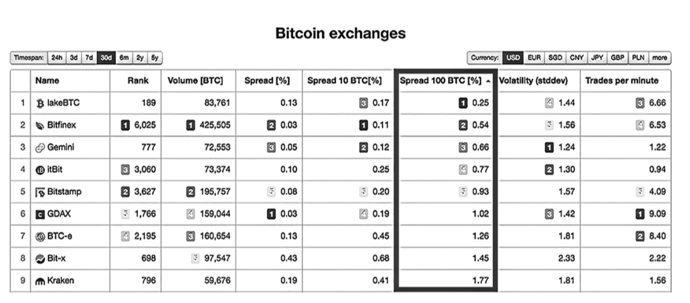

图9.1 比较不同交易所购买100比特币的效果
资料来源：Bitcoinity.org 截图的注释

更大的流动性，从更多的交易活动创建，因为有更多的人购买和出售比特币，全球交易量自 Mt. Gox 开放以来呈指数增长。[7]2017年1月5日，比特币交易量超过了110 亿美元并在历史上第二次突破1000美元每比特币（见图9.2）。

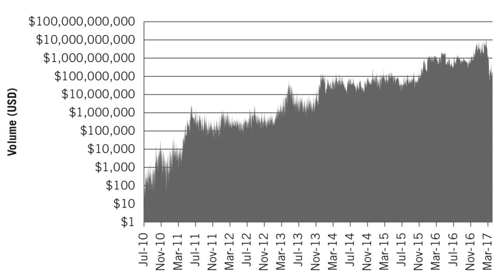

图9.2 比特币的交易量历史
数据来自CryptoCompare

如同股票交易从阿姆斯特丹的非正式场地发展到全球交易所每天交易数千亿美元，比特币也是这样发展的。我们现在全球有了数十家交易所，每天交易量为数亿到几十亿美元。增加的交易量是增加的利息的函数，带动了比特币市场的成熟。

## 加密资产交易量的演变

其他加密资产在成熟的过程中显示出类似的趋势，但是因为它们比比特币更年轻，它们在数量和流动性方面的差异较大。例如，在2016年，门罗币经历声名狼藉，主要是因为它的隐私保护功能开始被著名的黑暗市场利用[8] — 其平均交易量急速上升。在2015年12月，每日资产成交量为 27,300 美金，但到了 2016年12月是 325 万美金，增长大大超过了一百倍。资产的价格同期增长了 20 倍，因此交易量的上升部分原因是价格的升值，但很明显，大部分原因是由于对资产的增加的兴趣和交易活动。图9.3显示了门罗币的历史交易量。

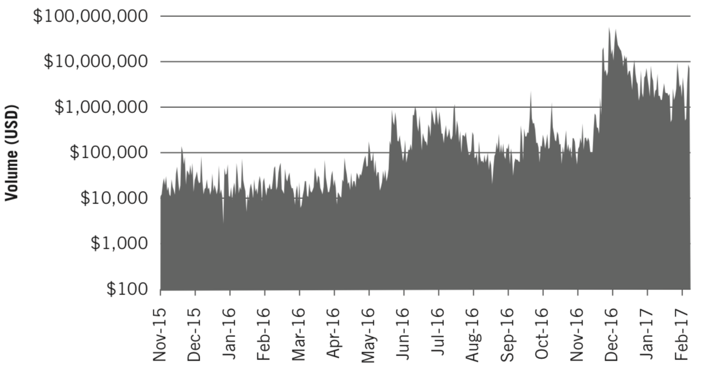

图9.3 门罗币的历史交易量
数据来自CryptoCompare

随着加密资产的成熟，以太、达世币、莱特币、瑞波币、以及其他加密资产在不同程度上显示出类似的交易量增长。由于价格大幅上涨，许多加密资产将在交易量上获得显著增长，因为资产上涨引起了投资者和交易商的更多关注。图9.3清楚地显示出门罗币的这样一个模式。然而，一旦加密资产稳定在了某个价格区间，其交易量也经常稳定在一个新的范围。一些加密资产交易商随后将寻求成交量的增加表明利息正在回升，而且资产价格的上涨可能正在出现。

无论交易者是否正确，迅速增长的利息、交易量和市场流动性都指向一个成熟的加密资产。如果持续下去，所有这些都是创新投资者意识到的健康状况良好的指标。但是，如果交易量的增加看起来太陡峭，而且为什么没有什么新闻支持，那么这是要谨慎的原因。 正如我们将在接下来的两章中关于投机所讨论的，有时候交易量上涨太快可能是操纵市场或市场过热的迹象。

## 监管对市场流动性的影响

尽管创新投资者通常可以期望具有实际价值的资产随着时间成熟并在流动性和交易量上增长，但影响市场的外部因素可能会大大降低交易量。 投资者变得容易激动，往往监管可以强制干预过度热情。 帮助资产度过这些困难时期的是全球交易和交易双方的多样性和深度。

2017年1月6日，比特币在一天内创下 110 亿美元的历史最高交易并在其历史上第二次超过1000美元币值大关后的第二天，中国人民银行（PBOC ）宣布正在研究比特币交易在中国的交易所交易。[9]此后不久，中国人民银行发布了比特币在中国境内的交易所交易的新规定，其中包括削减保证金交易、需要交易费，并要求更强的反洗钱和了解客户的协议。所有这些规定都是可以理解的，并有助于比特币合法化，但是它们确实导致在中国的交易量的明显下降，2016年的大部分时间，仍然是全球范围比特币交易量超过90％。[10]

中国占比特币全球交易量的90％以上，而现在中国人民银行对交易增加了限制。这个情况与2013年末事件令人恐惧得相似，在比特币第一次超过1000美元大关后，中国人民银行推出了新的规定。[11]比特币的价格则应声而落，并持续了下降了一年，因而许多人担心中国人民银行2017年的评论后同样会发生同样的事情。开始，价格确实急剧下跌，但一个月内就已经恢复，并很快升至历史高点。与2013年的反应截然不同。

比特币的价格在2017年快速反弹，相比于2013年毁灭性的价格的影响，为创新投资者揭示了对交易量、交易多样化，交易方多样性的重要性的宝贵经验。在2013年12月，交易量平均为 6000 万美元，而在2016年12月，平均为 41 亿美元。因此，有更显著的市场深度导致中国人民银行在2017年而不是2013年做出上述宣布。此外，2013年比特币在更有限的交易所发生交易（大部分活动是在Mt. Gox）。货币对的多样性也不那么稳健，都是通过不同的法币或其他密码资产。

2017年，由于市场的流动性、交易的多样性，以及交易方可选择性都同时具备，比特币能够迅速恢复。其结果是，当中国人民银行发布规定时，有很多其他中国以外的投资者和交易商的收拾残局，导致用于比特币交易的法币的市场份额反转，如图9.4所示。中国人民币元的市场份额从超过90％下降到不足十个百分点。

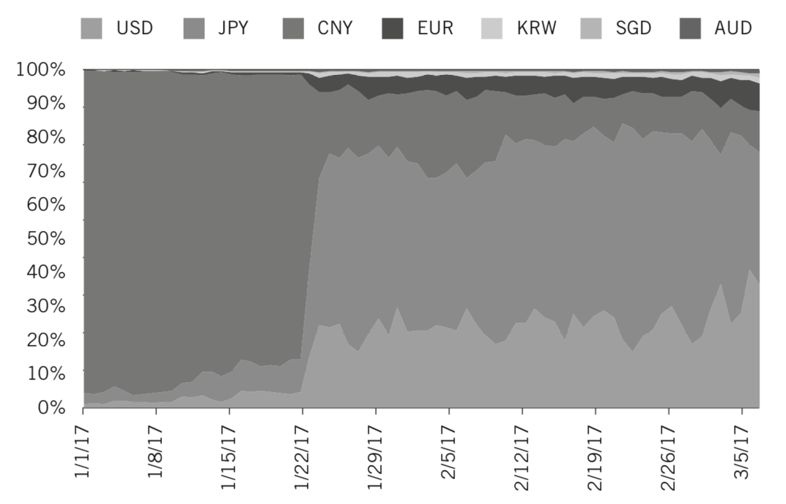

图9.4 各种货币对中比特币交易量的份额，突显了2017年1月中国人民币份额的下降
数据来自CryptoCompare

美元和日元交易在比特币的增加在2017年1月22日之后变得显著。比特币的交易商没有受到中国法规的长期影响，来自美国和日本的投资增加，填补了空白，并提振了比特币的价格。

## 交易方多样性是加密资产成熟的标志

平衡交易所和交易方的多样性对任何资产，包括加密资产的健壮性非常重要。从比特币在其不长的历史中的早期阶段依赖于过少的货币和交易所我们可以认识到，我们现在可以学习其他加密资产的交易方多样性，特别是在法币对方面。

法币对是加密资产尤为重要，因为它们需要与已经存在的金融基础设施显著整合。由于需要高水平的合规，只有少数加密资产交易所提供接受法币或者连接到投资者的银行账户的能力。这些交易所，如Bitstamp、GDAX、itBit、	Gemini、Kraken和其他几个人，都不愿意提供对所有加密资产的交易，因为他们不希望鼓励交易那些没有信誉的资产。由于他们的谨慎，只要盖章批准就可以将加密资产添加到他们的平台。

以太坊的以太提供了一个关于交易所添加密码资产可以增加用于购买资产的交易方的多样性的研究。如果我们关于法币在加密货币交易中重要性的假设成立，那么随着资产在成熟和合法性方面的增长，它在其交易对中应该有更多的多样性，同时被用来购买资产的法币强劲增长。

对于以太是肯定的。在图9.5中我们可以看到，在2016年中，用于买入以太的交易方的多样性显著增长。美元表现出了特别的力量，整体法币以太交易量从2016年春季的不到10％上涨到2017年春季的近50％。

我们鼓励创新投资者关注交易方多样性的增加，以此来检查更广泛的资产类别中的单个加密资产的日益稳健和成熟。CryptoCompare.com是确定这些趋势的好工具。

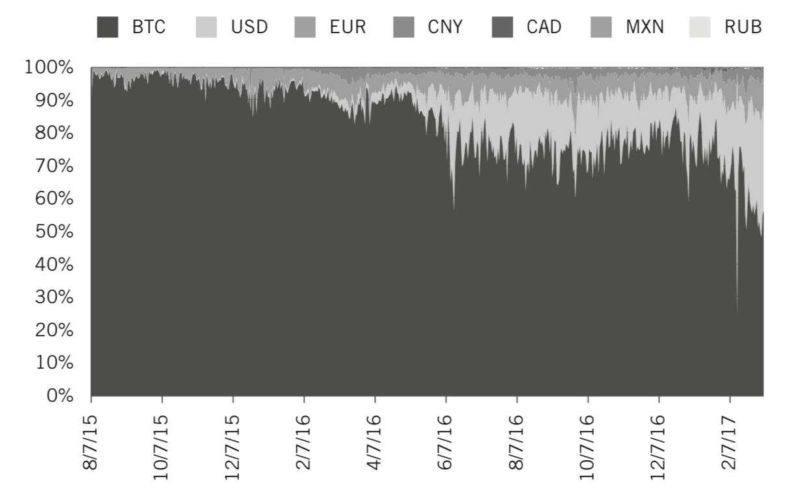

图9.5 以太交易方多样性的增加以及平台的使用
数据来自CryptoCompare

## 加密资产的成熟降低了波动性

更大的交易量，流动性，交易多样性和交易方多样性都会使市场更具弹性。 加密最好能够吸收冲击而不出现剧烈的价格波动 — 或者至少随着时间的推移价格波动严重程度下降 — 这会转化为波动性的下降。

我们预计，当我们绘制随时间推移的这种波动性时，会看到加密资产的波动性在下降。 由于我们已经在第7章中介绍了比特币降低的波动性，我们将在这里展示其他加密资产。 图9.6、9.7和9.8显示了随着时间的推移，以太、瑞波币和门罗币的波动。以下是使用 CryptoCompare 数据制作的图表，该数据为其他加密数据提供了类似的图表。[12]

从这些趋势，我们可以推断，波动性的下降是市场成熟度增加的结果。当然，趋势不是一条直线，并有显著的颠簸，这取决于具体的事件。例如，门罗币在2016年后期有波动性的尖峰，因为它经历了显著的价格上涨。这表明，波动性不仅与价格的下跌，但也有价格暴涨有关。然而，总的趋势是减弱波动（虽然在下面的图中没有描绘， 2017年第2季度和第3季度对加密资产波动较大，强调了波动性下降不会在一条直线上展开）。

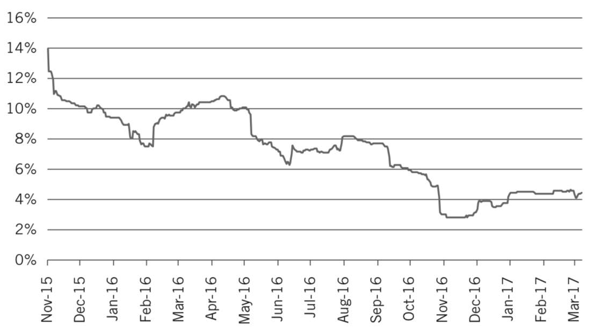

图9.6 以太的每日波动率下降
数据来自CryptoCompare

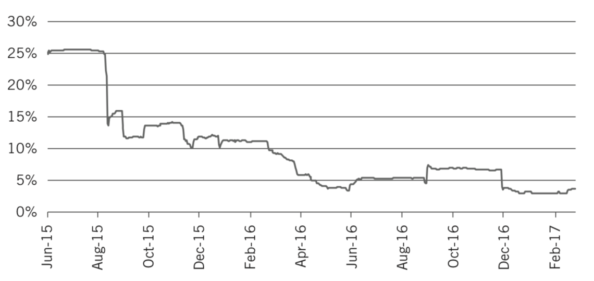

图9.7 瑞波币的每日波动率下降
数据来自CryptoCompare

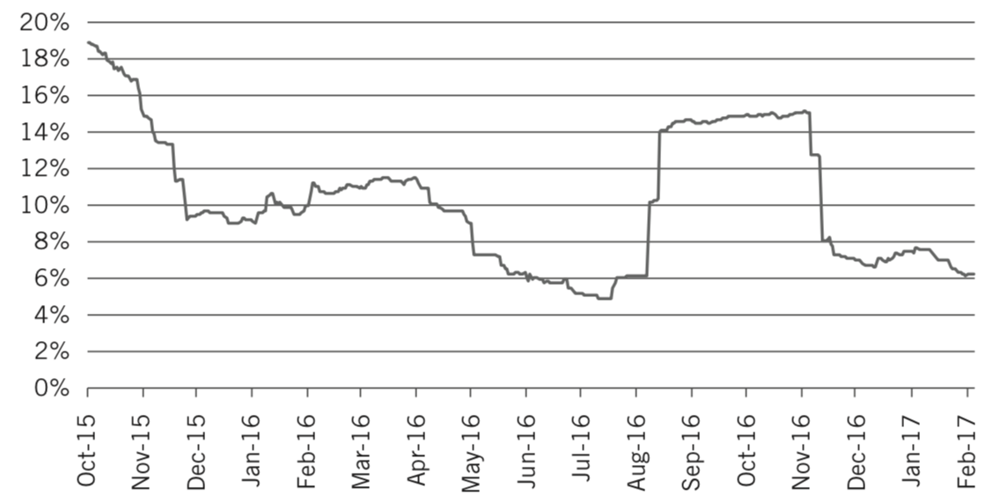

图9.8 门罗币的每日波动率下降
数据来自CryptoCompare

在图9.9中，我们比较了比特币、以太和达世币自2015年底的波动。比特币具有最低的波动性，因为它的市场是流动性最强的，它有来自不同的交易所和资产交易方支持的最大多样性。比特币保持了低的波动性，以太的波动性已经大幅下降，而达世币的变化很大。我们包括了达世币，因为我们认为随着时间的推移而它会继续存在波动性问题。虽然它越来越被接受，而这应该会降低其波动性，但它的体系结构通过要求主节点（类似于矿工的实体，但是达世币体系结构独特的实体）来锁定大量的达世币，从而产生流动性问题。这样的要求阻碍了达世币市场的流动性，因此使得市场更容易受到波动冲击。

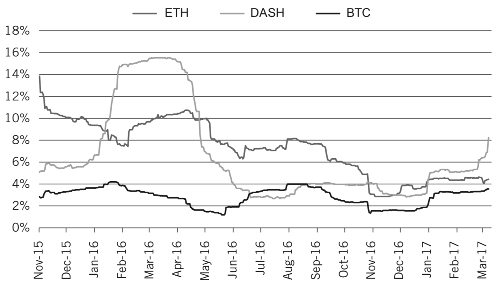

图9.9 比特币、达世币和以太的每日波动率
数据来自CryptoCompare

有趣的是，仅仅因为资产价格的快速上涨并不意味着它必须以不稳定的方式这样做。例如，在2016年，比特币的价格翻了一番多，但波动性下降。 其日常收益和偶尔的损失已经足够接近均值，而不会被注册为过度波动。这种行为可能表明大交易者在资产中持仓；他们衡量他们将资产的价格转移多少，并确保不超过一定的百分点。通过这种方式，他们可以最大限度地减少波动，并在几天，几周或几个月内缓慢地放大。

随着这些资产成熟以及波动性的降低，回想一下这可以帮助提高夏普比率。回想一下，由于夏普比率是绝对收益[13]除以波动率，所以如果波动率下降，那么收益不一定非常好而使得夏普比率仍然出色。

## 市场行为：相关性

由于一个资产类别第一次出现，它将与更广泛的资本市场无关，因为该资产的早期采用者与更广泛的资本市场投资者之间没有太多重叠。 这正是在比特币刚刚发明，只有一小部分开发人员和采用者知道时我们所看到的（见图9.10）。

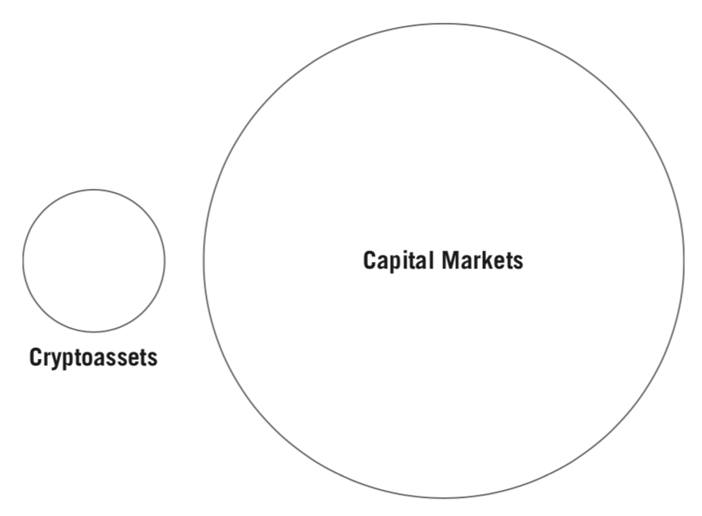

图9.10 作为新兴资产类别的加密资产

那时，比特币和资本市场投资者之间的重叠程度最小，比特币与其他常见资产类别的关联性接近于零；使更广泛的资本市场发生变化的事件对比特币没有影响，反之亦然（见图9.11）。

随着比特币的使用增加，它的名气也一样增大。现在，它几乎每周都会在**华尔街日报**，**纽约时报**和**福布斯**等刊物上进行例行讨论。因此，它不仅成为转型的一部分，而且还成为更广泛资本市场中更多受众的投资工具。[14]图9.12显示了加密资产覆盖范围扩大的图形描述。

比特币被资本市场投资者更多的接受解释了为什么它大涨的消息，可能损害到其他市场，如Brexit、特朗普的意外当选，和人民币的贬值。[15]

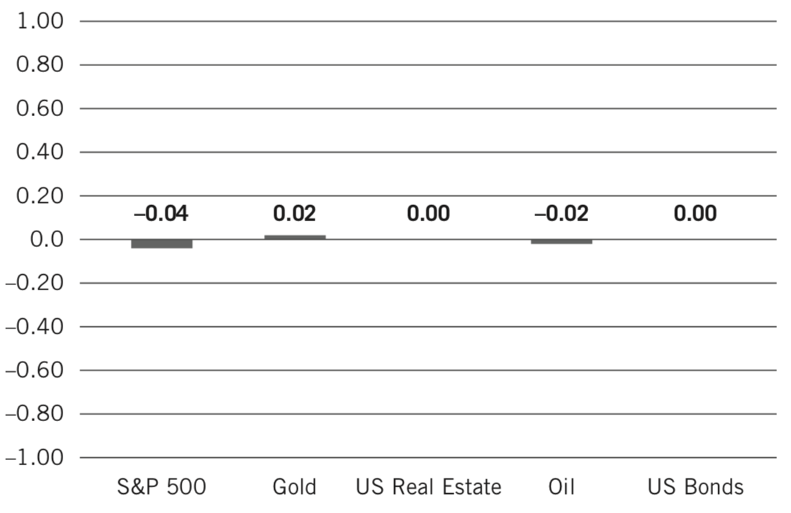

图9.11 2011年1月至2017年1月比特币与其他主要资产的平均30天滚动关联
数据来自彭博和CoinDesk

 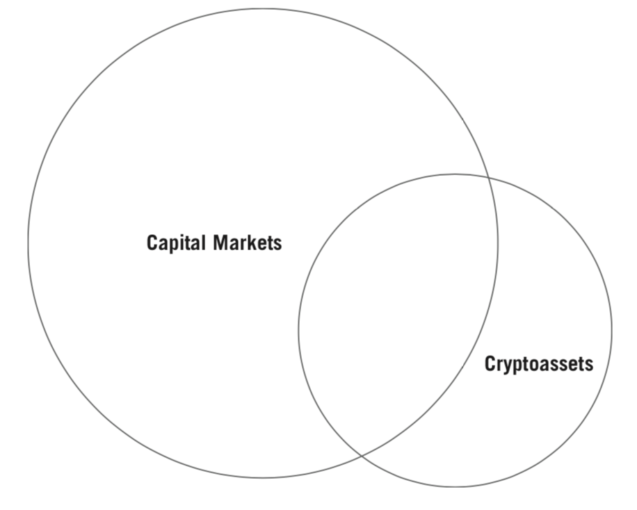

图9.12 加密资产作为一个成熟的资产类别

尽管中国人民银行采取了许多干预措施，但中国公民使用比特币来保护自己免受本国货币价值的侵蚀。 图9.13是推断这种行为的关键。在图表的左侧，y轴显示了需要购买一美元的中国人民币的数量。随着这个数字的增加，人民币的价值下降，因为需要更多的人民币来购买一美元。在右侧显示比特币的价格。随着人民币价值的下降，比特币的价格也在上涨。这种关联意味着人们可能会购买比特币来保护自己免受人民币进一步贬值。

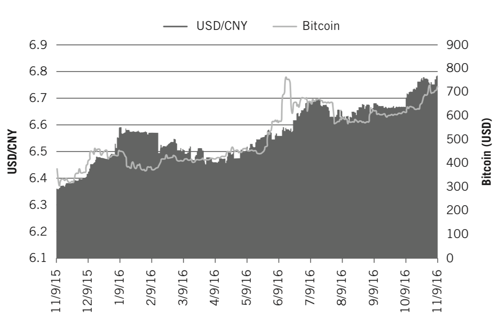

图9.13 比特币与人民币贬值有关的价格历史
来源：https://www.washingtonpost.com/news/wonk/wp/2017/01/03/why-bitcoin-just-had-an-amazing-year/?utm_term=.64a6cfdf7398

虽然我们预计比特币与其他广泛使用的资产类别日益相关（无论是正相关还是负相关），但随着新的加密资产的诞生，它们可能与更广泛的资本市场之间的关系低至零。充其量，它们将展示的是与比特币某种形式的相关，因为它属于同一资产类别。可以预期的是，同一资产类别中的例子将以某种方式一起变动。例如，2017年3月10日，在比特币与 Winklevoss 比特币 ETF 的决定之前，比特币变得越来越与以太币和门罗币相关联，并且与莱特币越来越负相关（见图9.14）。

由于莱特币是与比特币关系如此密切的衍生产品，因此投资者可能担心，比特币ETF获得批准，人们会卖出莱特币并买入比特币。另一方面，以太币和门罗币是明显不同的加密资产，因此在加密资产组合中作为比特币的补充持有。当比特币涨跌时，这些资产也是如此。这强化了创新投资者对这些资产特性的了解，并认识到哪里可能发生或可能不发生相关性。

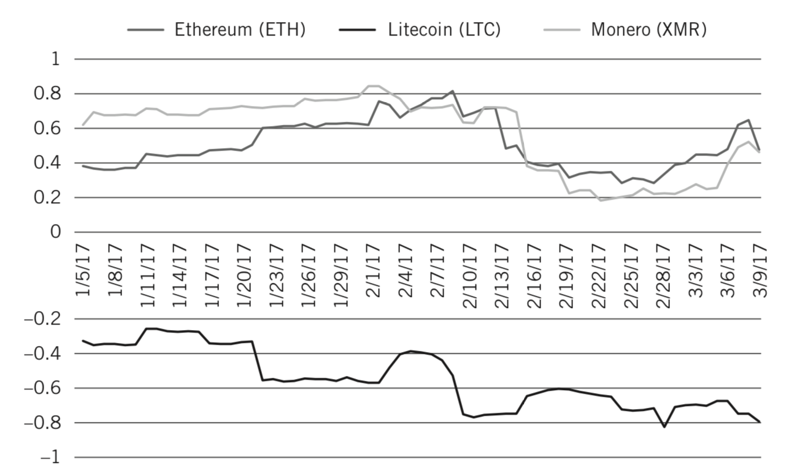

图9.14 比特币与乙以太，莱特币和门罗币的相关性，导致美国证券交易委员会拒绝了 Winklevoss ETF
数据来自CryptoCompare

我们预计会看到更多的这种相关趋势。最好的情况是，较新的加密资产会显示与比特币及其兄弟代币有关的一些行为，无论是正面还是负面。 随着密码资产的增长，其资本池也将随之增长，并且很快就会与更传统的资产重叠，从而加强其与更广泛的资本市场的价格关系。

虽然我们看到这些资产的成熟以及与其他资产的重叠程度加大，但认为比特币和加密资产处于早期阶段是合理的。 大部分投资者仍然缺乏了解。创新投资者可能比大多数人对这个主题的教育程度更高，但他们会遇到那些把加密资产看作是投机性的自卸车或更糟。接下来的两章将通过将加密资产置于过去的投资泡沫、欺诈和投机历史背景中来解决这些争论。